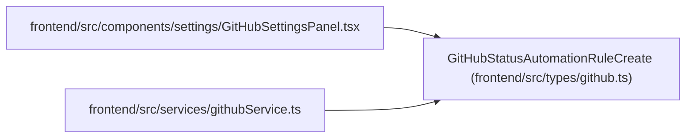

# GitHubStatusAutomationRuleCreate

**Location:** `frontend/src/types/github.ts:28`
**Kind:** Class
**Bases:** —
**Module:** [types_github](../modules/types_github.md)

## Description

_Auto-generated from `GitHubStatusAutomationRuleCreate` in `frontend/src/types/github.ts`._

## Attributes

| Name | Type | Required | Default | Description |
|------|------|----------|---------|-------------|
| `name` | `string` | Yes | — | — |
| `description` | `string \| null` | No | — | — |
| `enabled` | `boolean` | Yes | — | — |
| `github_event_type` | `GitHubAutomationEventType` | Yes | — | — |
| `from_status` | `TaskStatus \| null` | No | — | — |
| `target_status` | `GitHubAutomationTargetStatus` | Yes | — | — |
| `reason_template` | `string \| null` | No | — | — |
| `sort_order` | `number` | Yes | — | — |

## Methods

*No public methods. Inherits from base classes.*

## Relationships

<!-- Auto-generated relationship summary. Do not edit by hand. -->

### Summary

| Module | Methods | Attributes |
|---|---:|---|
| [types_github](../modules/types_github.md) | 0 | `description`, `enabled`, `from_status`, `github_event_type`, `name`, `reason_template`, `sort_order`, `target_status` |

### References

| Reference | Kind | Source | Call sites |
|---|---|---|---:|
| `GitHubSettingsPanel` | import | [GitHubSettingsPanel](../modules/GitHubSettingsPanel.md) | — |
| `githubService` | import | [githubService](../modules/githubService.md) | — |
