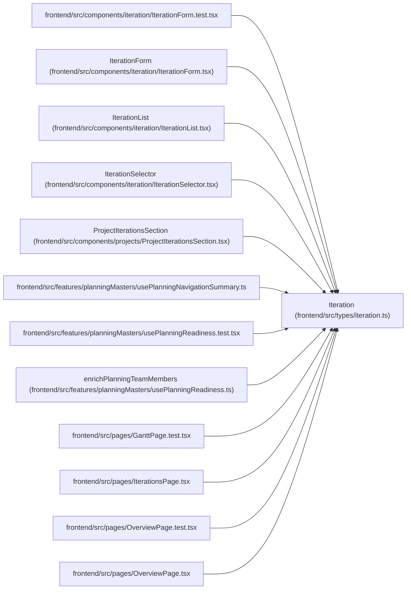

# Iteration

**Location:** `frontend/src/types/iteration.ts:8`
**Kind:** Class
**Bases:** —
**Module:** [types_iteration](../modules/types_iteration.md)

## Description

_Auto-generated from `Iteration` in `frontend/src/types/iteration.ts`._

## Attributes

| Name | Type | Default | Description |
|------|------|---------|-------------|
| `id` | `number` | *required* | — |
| `name` | `string` | *required* | — |
| `calendar_id` | `number` | *required* | — |
| `project_id` | `number \| null` | *required* | — |
| `project` | `IterationProject \| null` | *required* | — |
| `start_date` | `string` | *required* | — |
| `end_date` | `string` | *required* | — |
| `manager_email` | `string` | *required* | — |
| `working_days` | `number` | *required* | — |

## Methods

*No public methods. Inherits from base classes.*

## Relationships

<!-- Auto-generated relationship summary. Do not edit by hand. -->

### Summary

| Module | Methods | Attributes |
|---|---:|---|
| [types_iteration](../modules/types_iteration.md) | 0 | `calendar_id`, `end_date`, `id`, `manager_email`, `name`, `project`, `project_id`, `start_date`, `working_days` |

### References

| Reference | Kind | Source | Call sites |
|---|---|---|---:|
| `IterationForm.test` | import | [IterationForm.test](../modules/IterationForm.test.md) | — |
| `IterationForm` | type_reference | [IterationForm](../modules/IterationForm.md) | — |
| `IterationList` | type_reference | [IterationList](../modules/IterationList.md) | — |
| `IterationSelector` | type_reference | [IterationSelector](../modules/IterationSelector.md) | — |
| `ProjectIterationsSection` | type_reference | [ProjectIterationsSection](../modules/ProjectIterationsSection.md) | — |
| `usePlanningNavigationSummary` | import | [usePlanningNavigationSummary](../modules/usePlanningNavigationSummary.md) | — |
| `usePlanningReadiness.test` | import | [usePlanningReadiness.test](../modules/usePlanningReadiness.test.md) | — |
| `enrichPlanningTeamMembers` | type_reference | [usePlanningReadiness](../modules/usePlanningReadiness.md) | — |
| `GanttPage.test` | import | [GanttPage.test](../modules/GanttPage.test.md) | — |
| `IterationsPage` | import | [IterationsPage](../modules/IterationsPage.md) | — |
| `OverviewPage.test` | import | [OverviewPage.test](../modules/OverviewPage.test.md) | — |
| `OverviewPage` | import | [OverviewPage](../modules/OverviewPage.md) | — |

> References: showing 12 of 17 logical references; 5 omitted by the 12-row generated summary limit.
