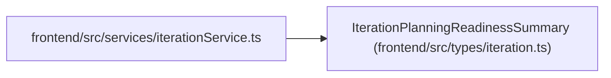

# IterationPlanningReadinessSummary

**Location:** `frontend/src/types/iteration.ts:73`
**Kind:** Class
**Bases:** —
**Module:** [types_iteration](../modules/types_iteration.md)

## Description

_Auto-generated from `IterationPlanningReadinessSummary` in `frontend/src/types/iteration.ts`._

## Attributes

| Name | Type | Default | Description |
|------|------|---------|-------------|
| `iteration_id` | `number` | *required* | — |
| `team_member_count` | `number` | *required* | — |
| `team_capacity_hours` | `number` | *required* | — |
| `team_members_no_capacity` | `number` | *required* | — |
| `task_count` | `number` | *required* | — |
| `tasks_without_assignee` | `number` | *required* | — |
| `tasks_without_effort` | `number` | *required* | — |
| `has_schedule` | `boolean` | *required* | — |
| `risk_count` | `number` | *required* | — |

## Methods

*No public methods. Inherits from base classes.*

## Relationships

<!-- Auto-generated relationship summary. Do not edit by hand. -->

### Summary

| Module | Methods | Attributes |
|---|---:|---|
| [types_iteration](../modules/types_iteration.md) | 0 | `has_schedule`, `iteration_id`, `risk_count`, `task_count`, `tasks_without_assignee`, `tasks_without_effort`, `team_capacity_hours`, `team_member_count`, `team_members_no_capacity` |

### References

| Reference | Kind | Source | Call sites |
|---|---|---|---:|
| `iterationService` | import | [iterationService](../modules/iterationService.md) | — |
