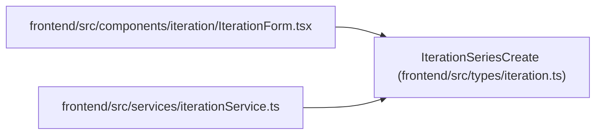

# IterationSeriesCreate

**Location:** `frontend/src/types/iteration.ts:45`
**Kind:** Class
**Bases:** —
**Module:** [types_iteration](../modules/types_iteration.md)

## Description

_Auto-generated from `IterationSeriesCreate` in `frontend/src/types/iteration.ts`._

## Attributes

| Name | Type | Required | Default | Description |
|------|------|----------|---------|-------------|
| `base_name` | `string` | Yes | — | — |
| `calendar_id` | `number \| null` | No | — | — |
| `project_id` | `number \| null` | No | — | — |
| `start_date` | `string` | Yes | — | — |
| `duration_days` | `number` | Yes | — | — |
| `stop` | `IterationSeriesStop` | Yes | — | — |
| `manager_email` | `string` | No | — | — |

## Methods

*No public methods. Inherits from base classes.*

## Relationships

<!-- Auto-generated relationship summary. Do not edit by hand. -->

### Summary

| Module | Methods | Attributes |
|---|---:|---|
| [types_iteration](../modules/types_iteration.md) | 0 | `base_name`, `calendar_id`, `duration_days`, `manager_email`, `project_id`, `start_date`, `stop` |

### References

| Reference | Kind | Source | Call sites |
|---|---|---|---:|
| `IterationForm` | import | [IterationForm](../modules/IterationForm.md) | — |
| `iterationService` | import | [iterationService](../modules/iterationService.md) | — |
