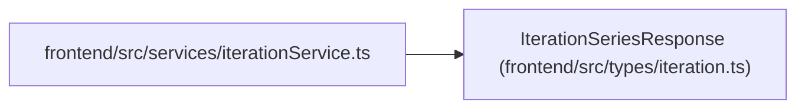

# IterationSeriesResponse

**Location:** `frontend/src/types/iteration.ts:55`
**Kind:** Class
**Bases:** —
**Module:** [types_iteration](../modules/types_iteration.md)

## Description

_Auto-generated from `IterationSeriesResponse` in `frontend/src/types/iteration.ts`._

## Attributes

| Name | Type | Required | Default | Description |
|------|------|----------|---------|-------------|
| `iterations` | `Iteration[]` | Yes | — | — |

## Methods

*No public methods. Inherits from base classes.*

## Relationships

<!-- Auto-generated relationship summary. Do not edit by hand. -->

### Summary

| Module | Methods | Attributes |
|---|---:|---|
| [types_iteration](../modules/types_iteration.md) | 0 | `iterations` |

### References

| Reference | Kind | Source | Call sites |
|---|---|---|---:|
| `iterationService` | import | [iterationService](../modules/iterationService.md) | — |
