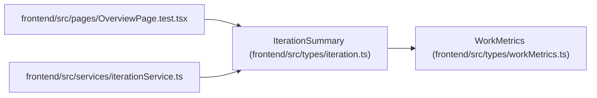

# IterationSummary

**Location:** `frontend/src/types/iteration.ts:59`
**Kind:** Class
**Bases:** `WorkMetrics`
**Module:** [types_iteration](../modules/types_iteration.md)

## Description

_Auto-generated from `IterationSummary` in `frontend/src/types/iteration.ts`._

## Attributes

| Name | Type | Required | Default | Description |
|------|------|----------|---------|-------------|
| `id` | `number` | Yes | — | — |
| `name` | `string` | Yes | — | — |
| `project_id` | `number \| null` | No | — | — |
| `project` | `IterationProject \| null` | No | — | — |
| `start_date` | `string` | Yes | — | — |
| `end_date` | `string` | Yes | — | — |
| `working_days` | `number` | Yes | — | — |
| `total_tasks` | `number` | Yes | — | — |
| `completed_tasks` | `number` | Yes | — | — |
| `total_effort_days` | `number` | Yes | — | — |
| `team_capacity_days` | `number` | Yes | — | — |
| `overdue_tasks_count` | `number` | Yes | — | — |

## Methods

*No public methods. Inherits from base classes.*

## Relationships

<!-- Auto-generated relationship summary. Do not edit by hand. -->

### Summary

| Module | Methods | Attributes |
|---|---:|---|
| [types_iteration](../modules/types_iteration.md) | 0 | `completed_tasks`, `end_date`, `id`, `name`, `overdue_tasks_count`, `project`, `project_id`, `start_date`, `team_capacity_days`, `total_effort_days`, `total_tasks`, `working_days` |

### Structure

| Kind | Entity | Module |
|---|---|---|
| Base | `WorkMetrics` | [workMetrics](../modules/workMetrics.md) |

### References

| Reference | Kind | Source | Call sites |
|---|---|---|---:|
| `OverviewPage.test` | import | [OverviewPage.test](../modules/OverviewPage.test.md) | — |
| `iterationService` | import | [iterationService](../modules/iterationService.md) | — |
