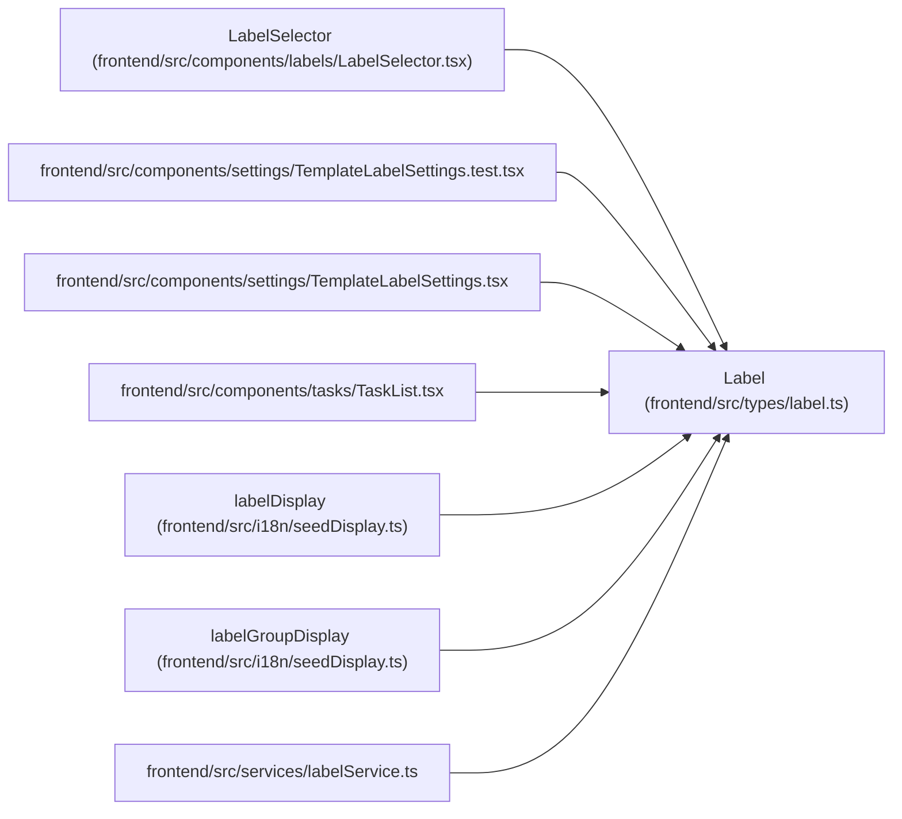

# Label

**Location:** `frontend/src/types/label.ts:9`
**Kind:** Class
**Bases:** —
**Module:** [types_label](../modules/types_label.md)

## Description

_Auto-generated from `Label` in `frontend/src/types/label.ts`._

## Attributes

| Name | Type | Default | Description |
|------|------|---------|-------------|
| `id` | `number` | *required* | — |
| `slug` | `string` | *required* | — |
| `name` | `string` | *required* | — |
| `group_id` | `number` | *required* | — |
| `group` | `LabelGroupBrief \| null` | *required* | — |
| `description` | `string \| null` | *required* | — |
| `color` | `string` | *required* | — |
| `is_active` | `boolean` | *required* | — |
| `sort_order` | `number` | *required* | — |
| `seed_key` | `string \| null` | *required* | — |
| `created_at` | `string` | *required* | — |
| `updated_at` | `string` | *required* | — |

## Methods

*No public methods. Inherits from base classes.*

## Relationships

<!-- Auto-generated relationship summary. Do not edit by hand. -->

### Summary

| Module | Methods | Attributes |
|---|---:|---|
| [types_label](../modules/types_label.md) | 0 | `color`, `created_at`, `description`, `group`, `group_id`, `id`, `is_active`, `name`, `seed_key`, `slug`, `sort_order`, `updated_at` |

### References

| Reference | Kind | Source | Call sites |
|---|---|---|---:|
| `LabelSelector` | type_reference | [LabelSelector](../modules/LabelSelector.md) | — |
| `TemplateLabelSettings.test` | import | [TemplateLabelSettings.test](../modules/TemplateLabelSettings.test.md) | — |
| `TemplateLabelSettings` | import | [TemplateLabelSettings](../modules/TemplateLabelSettings.md) | — |
| `TaskList` | import | [TaskList](../modules/TaskList.md) | — |
| `labelDisplay` | type_reference | [seedDisplay](../modules/seedDisplay.md) | — |
| `labelGroupDisplay` | type_reference | [seedDisplay](../modules/seedDisplay.md) | — |
| `labelService` | import | [labelService](../modules/labelService.md) | — |
