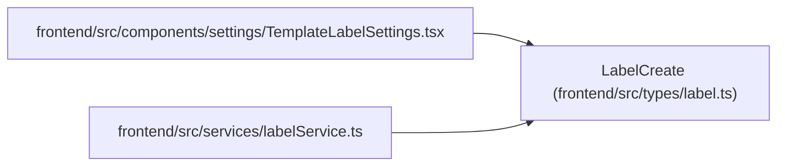

# LabelCreate

**Location:** `frontend/src/types/label.ts:49`
**Kind:** Class
**Bases:** —
**Module:** [types_label](../modules/types_label.md)

## Description

_Auto-generated from `LabelCreate` in `frontend/src/types/label.ts`._

## Attributes

| Name | Type | Required | Default | Description |
|------|------|----------|---------|-------------|
| `slug` | `string` | Yes | — | — |
| `name` | `string` | Yes | — | — |
| `group_id` | `number` | Yes | — | — |
| `description` | `string \| null` | No | — | — |
| `color` | `string` | No | — | — |
| `is_active` | `boolean` | No | — | — |
| `sort_order` | `number` | No | — | — |

## Methods

*No public methods. Inherits from base classes.*

## Relationships

<!-- Auto-generated relationship summary. Do not edit by hand. -->

### Summary

| Module | Methods | Attributes |
|---|---:|---|
| [types_label](../modules/types_label.md) | 0 | `color`, `description`, `group_id`, `is_active`, `name`, `slug`, `sort_order` |

### References

| Reference | Kind | Source | Call sites |
|---|---|---|---:|
| `TemplateLabelSettings` | import | [TemplateLabelSettings](../modules/TemplateLabelSettings.md) | — |
| `labelService` | import | [labelService](../modules/labelService.md) | — |
