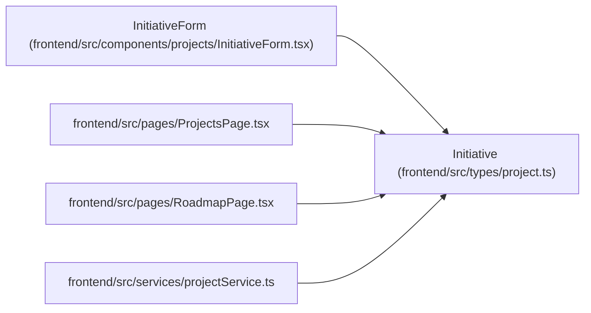

# Initiative

**Location:** `frontend/src/types/project.ts:13`
**Kind:** Class
**Bases:** —
**Module:** [types_project](../modules/types_project.md)

## Description

_Auto-generated from `Initiative` in `frontend/src/types/project.ts`._

## Attributes

| Name | Type | Required | Default | Description |
|------|------|----------|---------|-------------|
| `id` | `number` | Yes | — | — |
| `name` | `string` | Yes | — | — |
| `description` | `string \| null` | No | — | — |
| `owner_id` | `number \| null` | Yes | — | — |
| `owner` | `ProjectOwner \| null` | Yes | — | — |
| `owner_profile_id` | `number \| null` | Yes | — | — |
| `owner_profile` | `ProjectProfileOwner \| null` | Yes | — | — |
| `health` | `ProjectHealth` | Yes | — | — |
| `target_date` | `string \| null` | No | — | — |
| `created_at` | `string` | Yes | — | — |
| `updated_at` | `string` | Yes | — | — |

## Methods

*No public methods. Inherits from base classes.*

## Relationships

<!-- Auto-generated relationship summary. Do not edit by hand. -->

### Summary

| Module | Methods | Attributes |
|---|---:|---|
| [types_project](../modules/types_project.md) | 0 | `created_at`, `description`, `health`, `id`, `name`, `owner`, `owner_id`, `owner_profile`, `owner_profile_id`, `target_date`, `updated_at` |

### References

| Reference | Kind | Source | Call sites |
|---|---|---|---:|
| `InitiativeForm` | type_reference | [InitiativeForm](../modules/InitiativeForm.md) | — |
| `ProjectsPage` | import | [ProjectsPage](../modules/ProjectsPage.md) | — |
| `RoadmapPage` | import | [RoadmapPage](../modules/RoadmapPage.md) | — |
| `projectService` | import | [projectService](../modules/projectService.md) | — |
