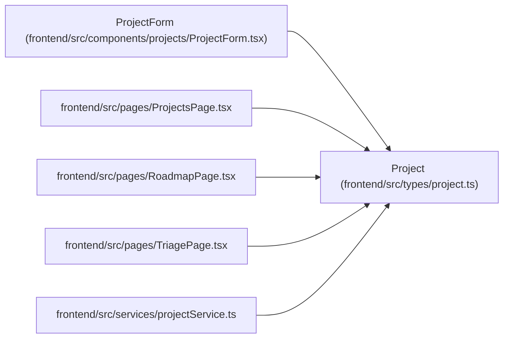

# Project

**Location:** `frontend/src/types/project.ts:55`
**Kind:** Class
**Bases:** —
**Module:** [types_project](../modules/types_project.md)

## Description

_Auto-generated from `Project` in `frontend/src/types/project.ts`._

## Attributes

| Name | Type | Default | Description |
|------|------|---------|-------------|
| `id` | `number` | *required* | — |
| `name` | `string` | *required* | — |
| `description` | `string \| null` | *required* | — |
| `status` | `ProjectStatus` | *required* | — |
| `health` | `ProjectHealth` | *required* | — |
| `owner_id` | `number \| null` | *required* | — |
| `owner` | `ProjectOwner \| null` | *required* | — |
| `owner_profile_id` | `number \| null` | *required* | — |
| `owner_profile` | `ProjectProfileOwner \| null` | *required* | — |
| `initiative_id` | `number \| null` | *required* | — |
| `initiative` | `ProjectInitiativeSummary \| null` | *required* | — |
| `start_date` | `string \| null` | *required* | — |
| `target_date` | `string \| null` | *required* | — |
| `completed_at` | `string \| null` | *required* | — |
| `sort_order` | `number` | *required* | — |
| `created_at` | `string` | *required* | — |
| `updated_at` | `string` | *required* | — |

## Methods

*No public methods. Inherits from base classes.*

## Relationships

<!-- Auto-generated relationship summary. Do not edit by hand. -->

### Summary

| Module | Methods | Attributes |
|---|---:|---|
| [types_project](../modules/types_project.md) | 0 | `completed_at`, `created_at`, `description`, `health`, `id`, `initiative`, `initiative_id`, `name`, `owner`, `owner_id`, `owner_profile`, `owner_profile_id` |

### References

| Reference | Kind | Source | Call sites |
|---|---|---|---:|
| `ProjectForm` | type_reference | [ProjectForm](../modules/ProjectForm.md) | — |
| `ProjectsPage` | import | [ProjectsPage](../modules/ProjectsPage.md) | — |
| `RoadmapPage` | import | [RoadmapPage](../modules/RoadmapPage.md) | — |
| `TriagePage` | import | [TriagePage](../modules/TriagePage.md) | — |
| `projectService` | import | [projectService](../modules/projectService.md) | — |
