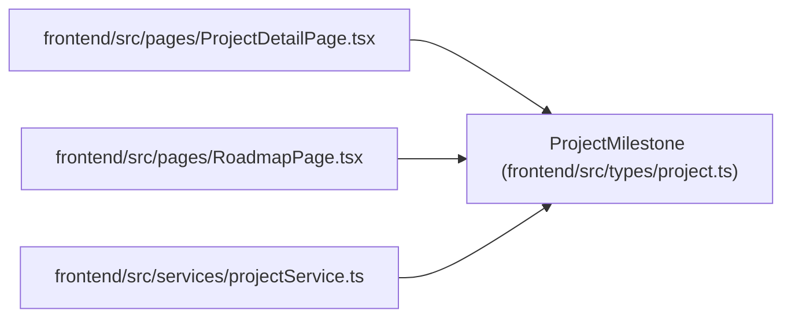

# ProjectMilestone

**Location:** `frontend/src/types/project.ts:125`
**Kind:** Class
**Bases:** —
**Module:** [types_project](../modules/types_project.md)

## Description

_Auto-generated from `ProjectMilestone` in `frontend/src/types/project.ts`._

## Attributes

| Name | Type | Required | Default | Description |
|------|------|----------|---------|-------------|
| `id` | `number` | Yes | — | — |
| `project_id` | `number` | Yes | — | — |
| `name` | `string` | Yes | — | — |
| `description` | `string \| null` | No | — | — |
| `target_date` | `string \| null` | No | — | — |
| `completed_at` | `string \| null` | No | — | — |
| `sort_order` | `number` | Yes | — | — |
| `status` | `ProjectMilestoneStatus` | Yes | — | — |
| `created_at` | `string` | Yes | — | — |
| `updated_at` | `string` | Yes | — | — |

## Methods

*No public methods. Inherits from base classes.*

## Relationships

<!-- Auto-generated relationship summary. Do not edit by hand. -->

### Summary

| Module | Methods | Attributes |
|---|---:|---|
| [types_project](../modules/types_project.md) | 0 | `completed_at`, `created_at`, `description`, `id`, `name`, `project_id`, `sort_order`, `status`, `target_date`, `updated_at` |

### References

| Reference | Kind | Source | Call sites |
|---|---|---|---:|
| `ProjectDetailPage` | import | [ProjectDetailPage](../modules/ProjectDetailPage.md) | — |
| `RoadmapPage` | import | [RoadmapPage](../modules/RoadmapPage.md) | — |
| `projectService` | import | [projectService](../modules/projectService.md) | — |
