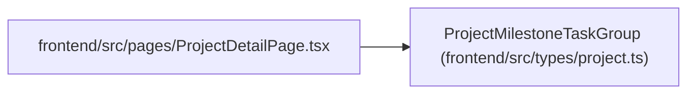

# ProjectMilestoneTaskGroup

**Location:** `frontend/src/types/project.ts:176`
**Kind:** Class
**Bases:** —
**Module:** [types_project](../modules/types_project.md)

## Description

_Auto-generated from `ProjectMilestoneTaskGroup` in `frontend/src/types/project.ts`._

## Attributes

| Name | Type | Required | Default | Description |
|------|------|----------|---------|-------------|
| `milestone_id` | `number \| null` | No | — | — |
| `milestone` | `ProjectMilestoneSummary \| null` | No | — | — |
| `name` | `string` | Yes | — | — |
| `task_count` | `number` | Yes | — | — |
| `completed_tasks` | `number` | Yes | — | — |
| `completion_percent` | `number` | Yes | — | — |
| `status_counts` | `Record<string, number>` | Yes | — | — |
| `total_effort_days` | `number` | Yes | — | — |
| `remaining_effort_days` | `number` | Yes | — | — |

## Methods

*No public methods. Inherits from base classes.*

## Relationships

<!-- Auto-generated relationship summary. Do not edit by hand. -->

### Summary

| Module | Methods | Attributes |
|---|---:|---|
| [types_project](../modules/types_project.md) | 0 | `completed_tasks`, `completion_percent`, `milestone`, `milestone_id`, `name`, `remaining_effort_days`, `status_counts`, `task_count`, `total_effort_days` |

### References

| Reference | Kind | Source | Call sites |
|---|---|---|---:|
| `ProjectDetailPage` | import | [ProjectDetailPage](../modules/ProjectDetailPage.md) | — |
