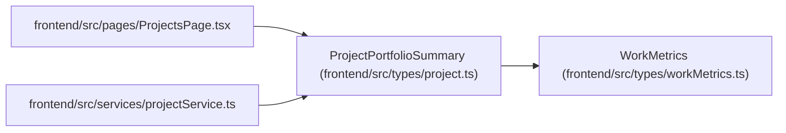

# ProjectPortfolioSummary

**Location:** `frontend/src/types/project.ts:188`
**Kind:** Class
**Bases:** `WorkMetrics`
**Module:** [types_project](../modules/types_project.md)

## Description

_Auto-generated from `ProjectPortfolioSummary` in `frontend/src/types/project.ts`._

## Attributes

| Name | Type | Default | Description |
|------|------|---------|-------------|
| `project_id` | `number` | *required* | — |
| `total_tasks` | `number` | *required* | — |
| `completed_tasks` | `number` | *required* | — |
| `total_effort_days` | `number` | *required* | — |
| `remaining_effort_days` | `number` | *required* | — |
| `blocked_tasks` | `number` | *required* | — |
| `overdue_tasks` | `number` | *required* | — |
| `target_date_risk` | `ProjectTargetDateRisk` | *required* | — |

## Methods

*No public methods. Inherits from base classes.*

## Relationships

<!-- Auto-generated relationship summary. Do not edit by hand. -->

### Summary

| Module | Methods | Attributes |
|---|---:|---|
| [types_project](../modules/types_project.md) | 0 | `blocked_tasks`, `completed_tasks`, `overdue_tasks`, `project_id`, `remaining_effort_days`, `target_date_risk`, `total_effort_days`, `total_tasks` |

### Structure

| Kind | Entity | Module |
|---|---|---|
| Base | `WorkMetrics` | [workMetrics](../modules/workMetrics.md) |

### References

| Reference | Kind | Source | Call sites |
|---|---|---|---:|
| `ProjectsPage` | import | [ProjectsPage](../modules/ProjectsPage.md) | — |
| `projectService` | import | [projectService](../modules/projectService.md) | — |
