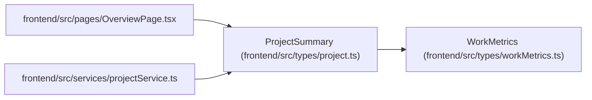

# ProjectSummary

**Location:** `frontend/src/types/project.ts:199`
**Kind:** Class
**Bases:** `WorkMetrics`
**Module:** [types_project](../modules/types_project.md)

## Description

_Auto-generated from `ProjectSummary` in `frontend/src/types/project.ts`._

## Attributes

| Name | Type | Required | Default | Description |
|------|------|----------|---------|-------------|
| `id` | `number` | Yes | — | — |
| `name` | `string` | Yes | — | — |
| `status` | `ProjectStatus` | Yes | — | — |
| `health` | `ProjectHealth` | Yes | — | — |
| `owner_id` | `number \| null` | Yes | — | — |
| `owner` | `ProjectOwner \| null` | Yes | — | — |
| `owner_profile_id` | `number \| null` | Yes | — | — |
| `owner_profile` | `ProjectProfileOwner \| null` | Yes | — | — |
| `initiative_id` | `number \| null` | No | — | — |
| `start_date` | `string \| null` | No | — | — |
| `target_date` | `string \| null` | No | — | — |
| `completed_at` | `string \| null` | No | — | — |
| `total_tasks` | `number` | Yes | — | — |
| `completed_tasks` | `number` | Yes | — | — |
| `completion_percent` | `number` | Yes | — | — |
| `active_tasks` | `number` | Yes | — | — |
| `blocked_tasks` | `number` | Yes | — | — |
| `overdue_tasks` | `number` | Yes | — | — |
| `target_date_risk` | `ProjectTargetDateRisk` | Yes | — | — |
| `target_date_risk_reason` | `string \| null` | No | — | — |
| `target_date_slip_days` | `number` | Yes | — | — |
| `days_until_target` | `number \| null` | No | — | — |
| `status_counts` | `Record<string, number>` | Yes | — | — |
| `total_effort_days` | `number` | Yes | — | — |
| `remaining_effort_days` | `number` | Yes | — | — |
| `milestone_groups` | `ProjectMilestoneTaskGroup[]` | Yes | — | — |
| `request_count` | `number` | Yes | — | — |
| `task_start_date` | `string \| null` | No | — | — |
| `task_end_date` | `string \| null` | No | — | — |
| `latest_update` | `ProjectUpdateEntry \| null` | No | — | — |
| `latest_update_at` | `string \| null` | No | — | — |
| `days_since_latest_update` | `number \| null` | No | — | — |
| `update_freshness` | `ProjectUpdateFreshness` | Yes | — | — |
| `is_update_stale` | `boolean` | Yes | — | — |
| `stale_update_threshold_days` | `number` | Yes | — | — |

## Methods

*No public methods. Inherits from base classes.*

## Relationships

<!-- Auto-generated relationship summary. Do not edit by hand. -->

### Summary

| Module | Methods | Attributes |
|---|---:|---|
| [types_project](../modules/types_project.md) | 0 | `active_tasks`, `blocked_tasks`, `completed_at`, `completed_tasks`, `completion_percent`, `days_since_latest_update`, `days_until_target`, `health`, `id`, `initiative_id`, `is_update_stale`, `latest_update` |

### Structure

| Kind | Entity | Module |
|---|---|---|
| Base | `WorkMetrics` | [workMetrics](../modules/workMetrics.md) |

### References

| Reference | Kind | Source | Call sites |
|---|---|---|---:|
| `OverviewPage` | import | [OverviewPage](../modules/OverviewPage.md) | — |
| `projectService` | import | [projectService](../modules/projectService.md) | — |
