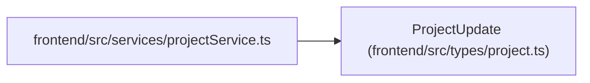

# ProjectUpdate

**Location:** `frontend/src/types/project.ts:89`
**Kind:** Class
**Bases:** —
**Module:** [types_project](../modules/types_project.md)

## Description

_Auto-generated from `ProjectUpdate` in `frontend/src/types/project.ts`._

## Attributes

| Name | Type | Default | Description |
|------|------|---------|-------------|
| `name` | `string` | *required* | — |
| `description` | `string \| null` | *required* | — |
| `status` | `ProjectStatus` | *required* | — |
| `health` | `ProjectHealth` | *required* | — |
| `owner_id` | `number \| null` | *required* | — |
| `owner_profile_id` | `number \| null` | *required* | — |
| `initiative_id` | `number \| null` | *required* | — |
| `start_date` | `string \| null` | *required* | — |
| `target_date` | `string \| null` | *required* | — |
| `completed_at` | `string \| null` | *required* | — |
| `sort_order` | `number` | *required* | — |

## Methods

*No public methods. Inherits from base classes.*

## Relationships

<!-- Auto-generated relationship summary. Do not edit by hand. -->

### Summary

| Module | Methods | Attributes |
|---|---:|---|
| [types_project](../modules/types_project.md) | 0 | `completed_at`, `description`, `health`, `initiative_id`, `name`, `owner_id`, `owner_profile_id`, `sort_order`, `start_date`, `status`, `target_date` |

### References

| Reference | Kind | Source | Call sites |
|---|---|---|---:|
| `projectService` | import | [projectService](../modules/projectService.md) | — |
