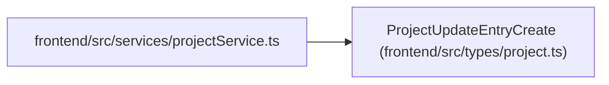

# ProjectUpdateEntryCreate

**Location:** `frontend/src/types/project.ts:116`
**Kind:** Class
**Bases:** —
**Module:** [types_project](../modules/types_project.md)

## Description

_Auto-generated from `ProjectUpdateEntryCreate` in `frontend/src/types/project.ts`._

## Attributes

| Name | Type | Default | Description |
|------|------|---------|-------------|
| `health` | `ProjectHealth` | *required* | — |
| `summary` | `string` | *required* | — |
| `progress_text` | `string \| null` | *required* | — |
| `risks_text` | `string \| null` | *required* | — |
| `decisions_text` | `string \| null` | *required* | — |
| `next_steps_text` | `string \| null` | *required* | — |

## Methods

*No public methods. Inherits from base classes.*

## Relationships

<!-- Auto-generated relationship summary. Do not edit by hand. -->

### Summary

| Module | Methods | Attributes |
|---|---:|---|
| [types_project](../modules/types_project.md) | 0 | `decisions_text`, `health`, `next_steps_text`, `progress_text`, `risks_text`, `summary` |

### References

| Reference | Kind | Source | Call sites |
|---|---|---|---:|
| `projectService` | import | [projectService](../modules/projectService.md) | — |
