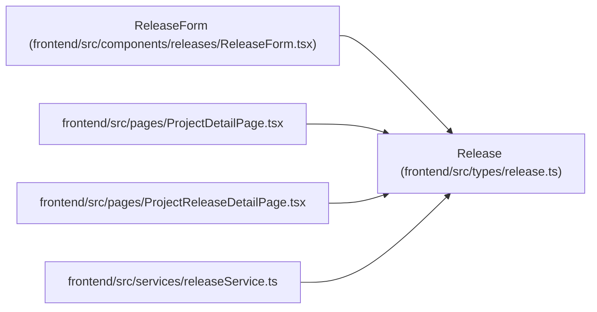

# Release

**Location:** `frontend/src/types/release.ts:12`
**Kind:** Class
**Bases:** —
**Module:** [types_release](../modules/types_release.md)

## Description

_Auto-generated from `Release` in `frontend/src/types/release.ts`._

## Attributes

| Name | Type | Default | Description |
|------|------|---------|-------------|
| `id` | `number` | *required* | — |
| `project_id` | `number` | *required* | — |
| `name` | `string` | *required* | — |
| `description` | `string \| null` | *required* | — |
| `status` | `ReleaseStatus` | *required* | — |
| `target_date` | `string \| null` | *required* | — |
| `shipped_at` | `string \| null` | *required* | — |
| `version` | `string \| null` | *required* | — |
| `environment` | `string \| null` | *required* | — |
| `task_ids` | `number[]` | *required* | — |
| `tasks` | `ReleaseTaskSummary[]` | *required* | — |
| `created_at` | `string` | *required* | — |
| `updated_at` | `string` | *required* | — |

## Methods

*No public methods. Inherits from base classes.*

## Relationships

<!-- Auto-generated relationship summary. Do not edit by hand. -->

### Summary

| Module | Methods | Attributes |
|---|---:|---|
| [types_release](../modules/types_release.md) | 0 | `created_at`, `description`, `environment`, `id`, `name`, `project_id`, `shipped_at`, `status`, `target_date`, `task_ids`, `tasks`, `updated_at` |

### References

| Reference | Kind | Source | Call sites |
|---|---|---|---:|
| `ReleaseForm` | type_reference | [ReleaseForm](../modules/ReleaseForm.md) | — |
| `ProjectDetailPage` | import | [ProjectDetailPage](../modules/ProjectDetailPage.md) | — |
| `ProjectReleaseDetailPage` | import | [ProjectReleaseDetailPage](../modules/ProjectReleaseDetailPage.md) | — |
| `releaseService` | import | [releaseService](../modules/releaseService.md) | — |
