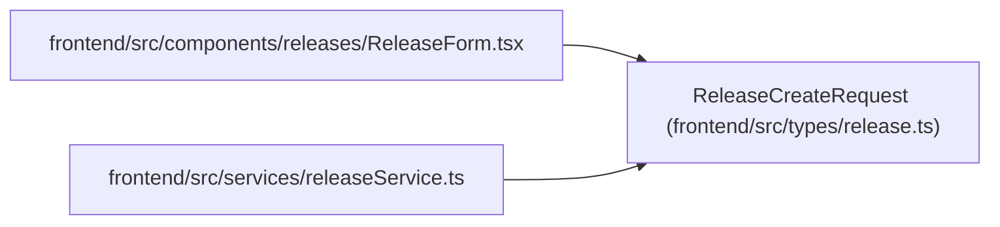

# ReleaseCreateRequest

**Location:** `frontend/src/types/release.ts:29`
**Kind:** Class
**Bases:** —
**Module:** [types_release](../modules/types_release.md)

## Description

_Auto-generated from `ReleaseCreateRequest` in `frontend/src/types/release.ts`._

## Attributes

| Name | Type | Required | Default | Description |
|------|------|----------|---------|-------------|
| `name` | `string` | Yes | — | — |
| `description` | `string \| null` | No | — | — |
| `status` | `ReleaseStatus` | No | — | — |
| `target_date` | `string \| null` | No | — | — |
| `shipped_at` | `string \| null` | No | — | — |
| `version` | `string \| null` | No | — | — |
| `environment` | `string \| null` | No | — | — |
| `task_ids` | `number[]` | No | — | — |

## Methods

*No public methods. Inherits from base classes.*

## Relationships

<!-- Auto-generated relationship summary. Do not edit by hand. -->

### Summary

| Module | Methods | Attributes |
|---|---:|---|
| [types_release](../modules/types_release.md) | 0 | `description`, `environment`, `name`, `shipped_at`, `status`, `target_date`, `task_ids`, `version` |

### References

| Reference | Kind | Source | Call sites |
|---|---|---|---:|
| `ReleaseForm` | import | [ReleaseForm](../modules/ReleaseForm.md) | — |
| `releaseService` | import | [releaseService](../modules/releaseService.md) | — |
