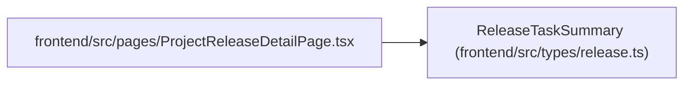

# ReleaseTaskSummary

**Location:** `frontend/src/types/release.ts:6`
**Kind:** Class
**Bases:** —
**Module:** [types_release](../modules/types_release.md)

## Description

_Auto-generated from `ReleaseTaskSummary` in `frontend/src/types/release.ts`._

## Attributes

| Name | Type | Required | Default | Description |
|------|------|----------|---------|-------------|
| `id` | `number` | Yes | — | — |
| `title` | `string` | Yes | — | — |
| `status` | `TaskStatus \| string` | Yes | — | — |
| `project_id` | `number \| null` | No | — | — |

## Methods

*No public methods. Inherits from base classes.*

## Relationships

<!-- Auto-generated relationship summary. Do not edit by hand. -->

### Summary

| Module | Methods | Attributes |
|---|---:|---|
| [types_release](../modules/types_release.md) | 0 | `id`, `project_id`, `status`, `title` |

### References

| Reference | Kind | Source | Call sites |
|---|---|---|---:|
| `ProjectReleaseDetailPage` | import | [ProjectReleaseDetailPage](../modules/ProjectReleaseDetailPage.md) | — |
