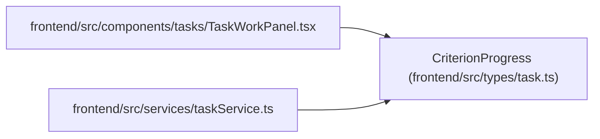

# CriterionProgress

**Location:** `frontend/src/types/task.ts:434`
**Kind:** Class
**Bases:** —
**Module:** [types_task](../modules/types_task.md)

## Description

_Auto-generated from `CriterionProgress` in `frontend/src/types/task.ts`._

## Attributes

| Name | Type | Required | Default | Description |
|------|------|----------|---------|-------------|
| `criterion_id` | `string` | Yes | — | — |
| `criterion_revision` | `number` | Yes | — | — |
| `state` | `'pending' \| 'in_progress' \| 'completed'` | Yes | — | — |
| `evidence` | `string` | Yes | — | — |

## Methods

*No public methods. Inherits from base classes.*

## Relationships

<!-- Auto-generated relationship summary. Do not edit by hand. -->

### Summary

| Module | Methods | Attributes |
|---|---:|---|
| [types_task](../modules/types_task.md) | 0 | `criterion_id`, `criterion_revision`, `evidence`, `state` |

### References

| Reference | Kind | Source | Call sites |
|---|---|---|---:|
| `TaskWorkPanel` | import | [TaskWorkPanel](../modules/TaskWorkPanel.md) | — |
| `taskService` | import | [taskService](../modules/taskService.md) | — |
