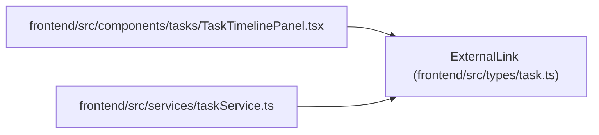

# ExternalLink

**Location:** `frontend/src/types/task.ts:48`
**Kind:** Class
**Bases:** —
**Module:** [types_task](../modules/types_task.md)

## Description

_Auto-generated from `ExternalLink` in `frontend/src/types/task.ts`._

## Attributes

| Name | Type | Required | Default | Description |
|------|------|----------|---------|-------------|
| `id` | `number \| null` | No | — | — |
| `entity_type` | `'task' \| 'project' \| 'release' \| string` | Yes | — | — |
| `entity_id` | `number` | Yes | — | — |
| `provider` | `ExternalLinkProvider` | Yes | — | — |
| `external_key` | `string \| null` | No | — | — |
| `url` | `string \| null` | No | — | — |
| `title` | `string \| null` | No | — | — |
| `status` | `string \| null` | No | — | — |
| `metadata_json` | `Record<string, unknown>` | Yes | — | — |
| `is_legacy` | `boolean` | Yes | — | — |
| `created_at` | `string \| null` | No | — | — |
| `updated_at` | `string \| null` | No | — | — |

## Methods

*No public methods. Inherits from base classes.*

## Relationships

<!-- Auto-generated relationship summary. Do not edit by hand. -->

### Summary

| Module | Methods | Attributes |
|---|---:|---|
| [types_task](../modules/types_task.md) | 0 | `created_at`, `entity_id`, `entity_type`, `external_key`, `id`, `is_legacy`, `metadata_json`, `provider`, `status`, `title`, `updated_at`, `url` |

### References

| Reference | Kind | Source | Call sites |
|---|---|---|---:|
| `TaskTimelinePanel` | import | [TaskTimelinePanel](../modules/TaskTimelinePanel.md) | — |
| `taskService` | import | [taskService](../modules/taskService.md) | — |
