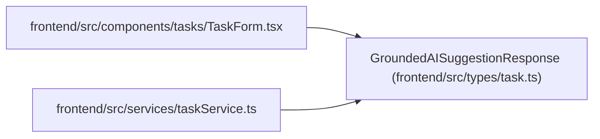

# GroundedAISuggestionResponse

**Location:** `frontend/src/types/task.ts:236`
**Kind:** Class
**Bases:** —
**Module:** [types_task](../modules/types_task.md)

## Description

_Auto-generated from `GroundedAISuggestionResponse` in `frontend/src/types/task.ts`._

## Attributes

| Name | Type | Default | Description |
|------|------|---------|-------------|
| `provider` | `string \| null` | *required* | — |
| `model` | `string \| null` | *required* | — |
| `language` | `'en' \| 'ru'` | *required* | — |
| `is_fallback` | `boolean` | *required* | — |
| `finish_reason` | `string \| null` | *required* | — |
| `is_truncated` | `boolean` | *required* | — |
| `suggested_title` | `string \| null` | *required* | — |
| `suggested_description` | `string` | *required* | — |
| `acceptance_criteria` | `string[]` | *required* | — |
| `implementation_notes` | `string[]` | *required* | — |
| `risks` | `string[]` | *required* | — |
| `open_questions` | `string[]` | *required* | — |
| `grounded_facts` | `GroundedFact[]` | *required* | — |
| `ungrounded_suggestions` | `string[]` | *required* | — |
| `warnings` | `string[]` | *required* | — |

## Methods

*No public methods. Inherits from base classes.*

## Relationships

<!-- Auto-generated relationship summary. Do not edit by hand. -->

### Summary

| Module | Methods | Attributes |
|---|---:|---|
| [types_task](../modules/types_task.md) | 0 | `acceptance_criteria`, `finish_reason`, `grounded_facts`, `implementation_notes`, `is_fallback`, `is_truncated`, `language`, `model`, `open_questions`, `provider`, `risks`, `suggested_description` |

### References

| Reference | Kind | Source | Call sites |
|---|---|---|---:|
| `TaskForm` | import | [TaskForm](../modules/TaskForm.md) | — |
| `taskService` | import | [taskService](../modules/taskService.md) | — |
