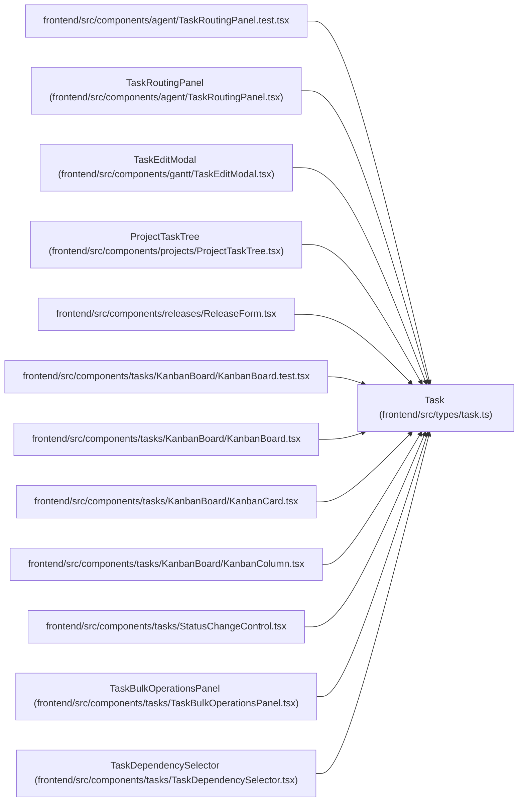

# Task

**Location:** `frontend/src/types/task.ts:84`
**Kind:** Class
**Bases:** —
**Module:** [types_task](../modules/types_task.md)

## Description

_Auto-generated from `Task` in `frontend/src/types/task.ts`._

## Attributes

| Name | Type | Default | Description |
|------|------|---------|-------------|
| `id` | `number` | *required* | — |
| `iteration_id` | `number` | *required* | — |
| `project_id` | `number \| null` | *required* | — |
| `milestone_id` | `number \| null` | *required* | — |
| `parent_id` | `number \| null` | *required* | — |
| `title` | `string` | *required* | — |
| `description` | `string` | *required* | — |
| `priority` | `number` | *required* | — |
| `effort_days` | `number` | *required* | — |
| `effort_hours` | `number` | *required* | — |
| `project` | `TaskProject \| null` | *required* | — |
| `milestone` | `TaskMilestone \| null` | *required* | — |
| `assignee` | `TaskAssignee \| null` | *required* | — |
| `status` | `TaskStatus` | *required* | — |
| `start_date` | `string \| null` | *required* | — |
| `end_date` | `string \| null` | *required* | — |
| `actual_start_date` | `string \| null` | *required* | — |
| `actual_end_date` | `string \| null` | *required* | — |
| `min_start_date` | `string \| null` | *required* | — |
| `max_end_date` | `string \| null` | *required* | — |
| `is_overdue` | `boolean` | *required* | — |
| `is_delayed` | `boolean` | *required* | — |
| `is_composite` | `boolean` | *required* | — |
| `is_optional` | `boolean` | *required* | — |
| `is_deferred` | `boolean` | *required* | — |
| `is_outside_constraints` | `boolean` | *required* | — |
| `tags` | `string[]` | *required* | — |
| `sort_order` | `number` | *required* | — |
| `external_key` | `string \| null` | *required* | — |
| `source` | `string \| null` | *required* | — |
| `source_url` | `string \| null` | *required* | — |
| `external_links` | `ExternalLink[]` | *required* | — |
| `request_count` | `number` | *required* | — |
| `agent_readiness` | `TaskAgentReadiness` | *required* | — |
| `version` | `number` | *required* | — |
| `claimed_by` | `TaskClaimedBy \| null` | *required* | — |
| `claim_expires_at` | `string \| null` | *required* | — |
| `updated_at` | `string \| null` | *required* | — |
| `children` | `Task[]` | *required* | — |
| `dependencies` | `number[]` | *required* | — |

## Methods

*No public methods. Inherits from base classes.*

## Relationships

<!-- Auto-generated relationship summary. Do not edit by hand. -->

### Summary

| Module | Methods | Attributes |
|---|---:|---|
| [types_task](../modules/types_task.md) | 0 | `actual_end_date`, `actual_start_date`, `agent_readiness`, `assignee`, `children`, `claim_expires_at`, `claimed_by`, `dependencies`, `description`, `effort_days`, `effort_hours`, `end_date` |

### References

| Reference | Kind | Source | Call sites |
|---|---|---|---:|
| `TaskRoutingPanel.test` | import | [TaskRoutingPanel.test](../modules/TaskRoutingPanel.test.md) | — |
| `TaskRoutingPanel` | type_reference | [TaskRoutingPanel](../modules/TaskRoutingPanel.md) | — |
| `TaskEditModal` | type_reference | [TaskEditModal](../modules/TaskEditModal.md) | — |
| `ProjectTaskTree` | type_reference | [ProjectTaskTree](../modules/ProjectTaskTree.md) | — |
| `ReleaseForm` | import | [ReleaseForm](../modules/ReleaseForm.md) | — |
| `KanbanBoard.test` | import | [KanbanBoard.test](../modules/KanbanBoard.test.md) | — |
| `KanbanBoard` | import | [KanbanBoard](../modules/KanbanBoard.md) | — |
| `KanbanCard` | import | [KanbanCard](../modules/KanbanCard.md) | — |
| `KanbanColumn` | import | [KanbanColumn](../modules/KanbanColumn.md) | — |
| `StatusChangeControl` | import | [StatusChangeControl](../modules/StatusChangeControl.md) | — |
| `TaskBulkOperationsPanel` | type_reference | [TaskBulkOperationsPanel](../modules/TaskBulkOperationsPanel.md) | — |
| `TaskDependencySelector` | type_reference | [TaskDependencySelector](../modules/TaskDependencySelector.md) | — |

> References: showing 12 of 52 logical references; 40 omitted by the 12-row generated summary limit.
