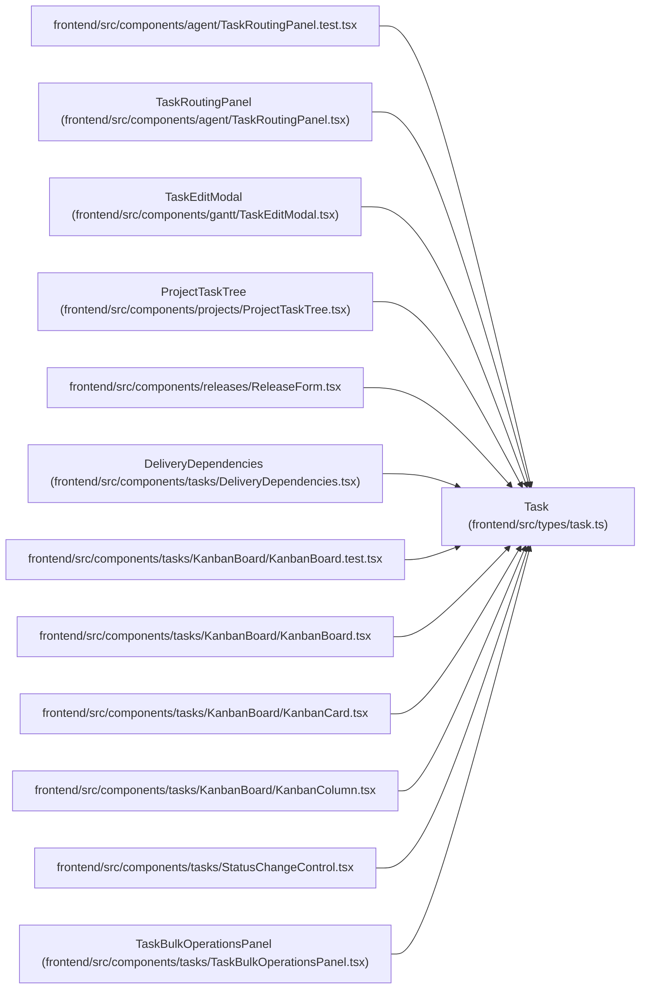

# Task

**Location:** `frontend/src/types/task.ts:85`
**Kind:** Class
**Bases:** —
**Module:** [types_task](../modules/types_task.md)

## Description

_Auto-generated from `Task` in `frontend/src/types/task.ts`._

## Attributes

| Name | Type | Required | Default | Description |
|------|------|----------|---------|-------------|
| `iteration_revision` | `number` | No | — | — |
| `effective_is_deferred` | `boolean` | No | — | — |
| `effective_is_optional` | `boolean` | No | — | — |
| `metric_contract_version` | `number` | No | — | — |
| `is_late_start` | `boolean` | No | — | — |
| `is_iteration_overflow` | `boolean` | No | — | — |
| `is_project_target_overflow` | `boolean` | No | — | — |
| `is_implemented` | `boolean` | No | — | — |
| `is_accepted` | `boolean` | No | — | — |
| `acceptance_unknown` | `boolean` | No | — | — |
| `owner_profile_id` | `number \| null` | No | — | — |
| `owner` | `TaskAssignee \| null` | No | — | — |
| `ownership_provenance` | `string` | No | — | — |
| `nominal_day_hours` | `number` | No | — | — |
| `estimate_provenance` | `string` | No | — | — |
| `brief` | `TaskBrief \| null` | No | — | — |
| `brief_revision` | `number` | No | — | — |
| `brief_provenance` | `string` | No | — | — |
| `legacy_description` | `string \| null` | No | — | — |
| `brief_migration_notes` | `string[]` | No | — | — |
| `progress` | `TaskProgress \| null` | No | — | — |
| `artifact_revision` | `number` | No | — | — |
| `execution_mode` | `'manual' \| 'scheduled'` | No | — | — |
| `blocked_reason` | `string \| null` | No | — | — |
| `canceled_at` | `string \| null` | No | — | — |
| `canceled_reason` | `string \| null` | No | — | — |
| `detail_context` | `TaskDetail` | No | — | — |
| `baseline_start_date` | `string \| null` | No | — | — |
| `baseline_end_date` | `string \| null` | No | — | — |
| `baseline_revision` | `number` | No | — | — |
| `baseline_provenance` | `string` | No | — | — |
| `started_at` | `string \| null` | No | — | — |
| `resolved_at` | `string \| null` | No | — | — |
| `accepted_at` | `string \| null` | No | — | — |
| `id` | `number` | Yes | — | — |
| `iteration_id` | `number \| null` | Yes | — | — |
| `project_id` | `number \| null` | No | — | — |
| `milestone_id` | `number \| null` | No | — | — |
| `parent_id` | `number \| null` | No | — | — |
| `title` | `string` | Yes | — | — |
| `description` | `string` | No | — | — |
| `priority` | `number` | Yes | — | — |
| `effort_days` | `number \| null` | Yes | — | — |
| `effort_hours` | `number \| null` | Yes | — | — |
| `project` | `TaskProject \| null` | No | — | — |
| `milestone` | `TaskMilestone \| null` | No | — | — |
| `assignee` | `TaskAssignee \| null` | No | — | — |
| `status` | `TaskStatus` | Yes | — | — |
| `start_date` | `string \| null` | No | — | — |
| `end_date` | `string \| null` | No | — | — |
| `actual_start_date` | `string \| null` | No | — | — |
| `actual_end_date` | `string \| null` | No | — | — |
| `min_start_date` | `string \| null` | No | — | — |
| `max_end_date` | `string \| null` | No | — | — |
| `is_overdue` | `boolean` | Yes | — | — |
| `is_delayed` | `boolean` | Yes | — | — |
| `is_composite` | `boolean` | Yes | — | — |
| `is_optional` | `boolean` | Yes | — | — |
| `is_deferred` | `boolean` | Yes | — | — |
| `is_outside_constraints` | `boolean` | No | — | — |
| `tags` | `string[]` | Yes | — | — |
| `sort_order` | `number` | Yes | — | — |
| `external_key` | `string \| null` | No | — | — |
| `source` | `string \| null` | No | — | — |
| `source_url` | `string \| null` | No | — | — |
| `external_links` | `ExternalLink[]` | Yes | — | — |
| `request_count` | `number` | Yes | — | — |
| `agent_readiness` | `TaskAgentReadiness` | Yes | — | — |
| `version` | `number` | Yes | — | — |
| `claimed_by` | `TaskClaimedBy \| null` | No | — | — |
| `claim_expires_at` | `string \| null` | No | — | — |
| `updated_at` | `string \| null` | No | — | — |
| `children` | `Task[]` | Yes | — | — |
| `dependencies` | `number[]` | Yes | — | — |

## Methods

*No public methods. Inherits from base classes.*

## Relationships

<!-- Auto-generated relationship summary. Do not edit by hand. -->

### Summary

| Module | Methods | Attributes |
|---|---:|---|
| [types_task](../modules/types_task.md) | 0 | `acceptance_unknown`, `accepted_at`, `actual_end_date`, `actual_start_date`, `agent_readiness`, `artifact_revision`, `assignee`, `baseline_end_date`, `baseline_provenance`, `baseline_revision`, `baseline_start_date`, `blocked_reason` |

### References

| Reference | Kind | Source | Call sites |
|---|---|---|---:|
| `TaskRoutingPanel.test` | import | [TaskRoutingPanel.test](../modules/TaskRoutingPanel.test.md) | — |
| `TaskRoutingPanel` | type_reference | [TaskRoutingPanel](../modules/TaskRoutingPanel.md) | — |
| `TaskEditModal` | type_reference | [TaskEditModal](../modules/TaskEditModal.md) | — |
| `ProjectTaskTree` | type_reference | [ProjectTaskTree](../modules/ProjectTaskTree.md) | — |
| `ReleaseForm` | import | [ReleaseForm](../modules/ReleaseForm.md) | — |
| `DeliveryDependencies` | type_reference | [DeliveryDependencies](../modules/DeliveryDependencies.md) | — |
| `KanbanBoard.test` | import | [KanbanBoard.test](../modules/KanbanBoard.test.md) | — |
| `KanbanBoard` | import | [KanbanBoard](../modules/KanbanBoard.md) | — |
| `KanbanCard` | import | [KanbanCard](../modules/KanbanCard.md) | — |
| `KanbanColumn` | import | [KanbanColumn](../modules/KanbanColumn.md) | — |
| `StatusChangeControl` | import | [StatusChangeControl](../modules/StatusChangeControl.md) | — |
| `TaskBulkOperationsPanel` | type_reference | [TaskBulkOperationsPanel](../modules/TaskBulkOperationsPanel.md) | — |

> References: showing 12 of 57 logical references; 45 omitted by the 12-row generated summary limit.
