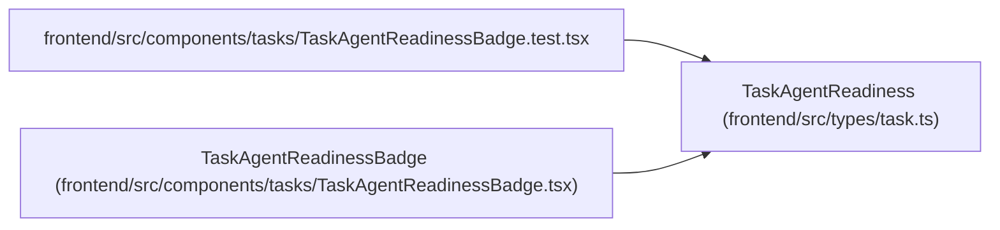

# TaskAgentReadiness

**Location:** `frontend/src/types/task.ts:37`
**Kind:** Class
**Bases:** —
**Module:** [types_task](../modules/types_task.md)

## Description

_Auto-generated from `TaskAgentReadiness` in `frontend/src/types/task.ts`._

## Attributes

| Name | Type | Required | Default | Description |
|------|------|----------|---------|-------------|
| `blocker_codes` | `string[]` | No | — | — |
| `is_ready` | `boolean` | Yes | — | — |
| `blockers` | `string[]` | Yes | — | — |
| `warnings` | `string[]` | Yes | — | — |
| `criteria` | `TaskAgentReadinessCriterion[]` | Yes | — | — |

## Methods

*No public methods. Inherits from base classes.*

## Relationships

<!-- Auto-generated relationship summary. Do not edit by hand. -->

### Summary

| Module | Methods | Attributes |
|---|---:|---|
| [types_task](../modules/types_task.md) | 0 | `blocker_codes`, `blockers`, `criteria`, `is_ready`, `warnings` |

### References

| Reference | Kind | Source | Call sites |
|---|---|---|---:|
| `TaskAgentReadinessBadge.test` | import | [TaskAgentReadinessBadge.test](../modules/TaskAgentReadinessBadge.test.md) | — |
| `TaskAgentReadinessBadge` | type_reference | [TaskAgentReadinessBadge](../modules/TaskAgentReadinessBadge.md) | — |
