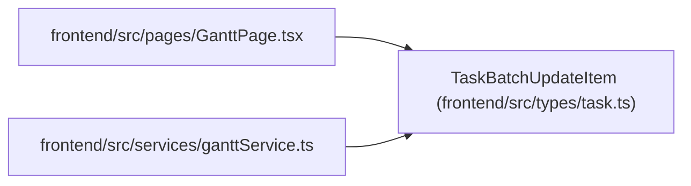

# TaskBatchUpdateItem

**Location:** `frontend/src/types/task.ts:345`
**Kind:** Class
**Bases:** —
**Module:** [types_task](../modules/types_task.md)

## Description

_Auto-generated from `TaskBatchUpdateItem` in `frontend/src/types/task.ts`._

## Attributes

| Name | Type | Default | Description |
|------|------|---------|-------------|
| `task_id` | `number` | *required* | — |
| `update` | `TaskUpdate` | *required* | — |
| `status_reason` | `string \| null` | *required* | — |
| `expected_version` | `number` | *required* | — |

## Methods

*No public methods. Inherits from base classes.*

## Relationships

<!-- Auto-generated relationship summary. Do not edit by hand. -->

### Summary

| Module | Methods | Attributes |
|---|---:|---|
| [types_task](../modules/types_task.md) | 0 | `expected_version`, `status_reason`, `task_id`, `update` |

### References

| Reference | Kind | Source | Call sites |
|---|---|---|---:|
| `GanttPage` | import | [GanttPage](../modules/GanttPage.md) | — |
| `ganttService` | import | [ganttService](../modules/ganttService.md) | — |
