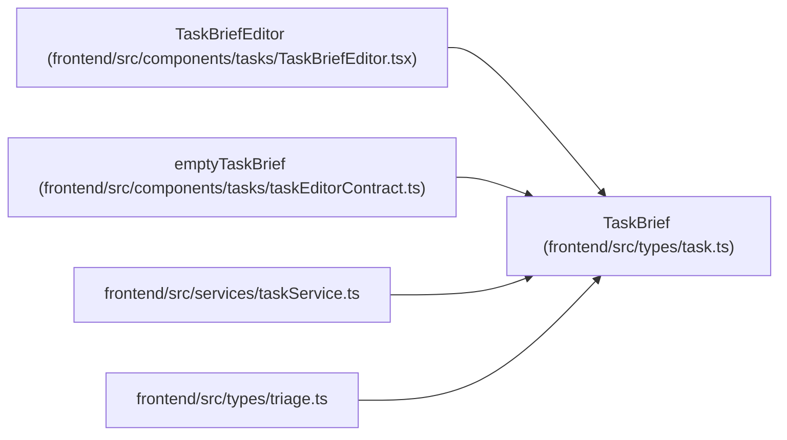

# TaskBrief

**Location:** `frontend/src/types/task.ts:424`
**Kind:** Class
**Bases:** —
**Module:** [types_task](../modules/types_task.md)

## Description

_Auto-generated from `TaskBrief` in `frontend/src/types/task.ts`._

## Attributes

| Name | Type | Required | Default | Description |
|------|------|----------|---------|-------------|
| `schema_version` | `1` | Yes | — | — |
| `goal` | `string` | Yes | — | — |
| `context` | `string` | Yes | — | — |
| `scope` | `string` | Yes | — | — |
| `exclusions` | `string` | Yes | — | — |
| `acceptance_criteria` | `BriefCriterion[]` | Yes | — | — |
| `verification` | `string` | Yes | — | — |
| `artifact_expectations` | `string` | Yes | — | — |

## Methods

*No public methods. Inherits from base classes.*

## Relationships

<!-- Auto-generated relationship summary. Do not edit by hand. -->

### Summary

| Module | Methods | Attributes |
|---|---:|---|
| [types_task](../modules/types_task.md) | 0 | `acceptance_criteria`, `artifact_expectations`, `context`, `exclusions`, `goal`, `schema_version`, `scope`, `verification` |

### References

| Reference | Kind | Source | Call sites |
|---|---|---|---:|
| `TaskBriefEditor` | type_reference | [TaskBriefEditor](../modules/TaskBriefEditor.md) | — |
| `emptyTaskBrief` | type_reference | [taskEditorContract](../modules/taskEditorContract.md) | — |
| `taskService` | import | [taskService](../modules/taskService.md) | — |
| `triage` | import | [types_triage](../modules/types_triage.md) | — |
