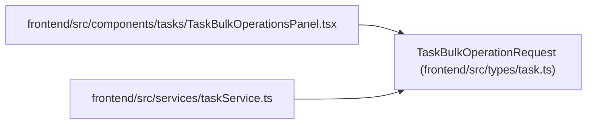

# TaskBulkOperationRequest

**Location:** `frontend/src/types/task.ts:293`
**Kind:** Class
**Bases:** —
**Module:** [types_task](../modules/types_task.md)

## Description

_Auto-generated from `TaskBulkOperationRequest` in `frontend/src/types/task.ts`._

## Attributes

| Name | Type | Default | Description |
|------|------|---------|-------------|
| `expected_versions` | `Record<number, number>` | *required* | — |
| `expected_revisions` | `Record<number, number>` | *required* | — |
| `task_ids` | `number[]` | *required* | — |
| `action` | `TaskBulkAction` | *required* | — |
| `payload` | `Record<string, unknown>` | *required* | — |
| `dry_run` | `boolean` | *required* | — |

## Methods

*No public methods. Inherits from base classes.*

## Relationships

<!-- Auto-generated relationship summary. Do not edit by hand. -->

### Summary

| Module | Methods | Attributes |
|---|---:|---|
| [types_task](../modules/types_task.md) | 0 | `action`, `dry_run`, `expected_revisions`, `expected_versions`, `payload`, `task_ids` |

### References

| Reference | Kind | Source | Call sites |
|---|---|---|---:|
| `TaskBulkOperationsPanel` | import | [TaskBulkOperationsPanel](../modules/TaskBulkOperationsPanel.md) | — |
| `taskService` | import | [taskService](../modules/taskService.md) | — |
