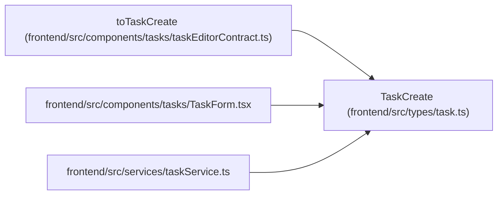

# TaskCreate

**Location:** `frontend/src/types/task.ts:127`
**Kind:** Class
**Bases:** —
**Module:** [types_task](../modules/types_task.md)

## Description

_Auto-generated from `TaskCreate` in `frontend/src/types/task.ts`._

## Attributes

| Name | Type | Default | Description |
|------|------|---------|-------------|
| `parent_id` | `number \| null` | *required* | — |
| `title` | `string` | *required* | — |
| `description` | `string` | *required* | — |
| `priority` | `number` | *required* | — |
| `effort_days` | `number` | *required* | — |
| `effort_hours` | `number` | *required* | — |
| `assignee_id` | `number \| null` | *required* | — |
| `project_id` | `number \| null` | *required* | — |
| `milestone_id` | `number \| null` | *required* | — |
| `depends_on` | `number[]` | *required* | — |
| `is_optional` | `boolean` | *required* | — |
| `is_deferred` | `boolean` | *required* | — |
| `tags` | `string[]` | *required* | — |
| `sort_order` | `number` | *required* | — |
| `min_start_date` | `string \| null` | *required* | — |
| `max_end_date` | `string \| null` | *required* | — |
| `external_key` | `string \| null` | *required* | — |
| `source` | `string \| null` | *required* | — |
| `source_url` | `string \| null` | *required* | — |

## Methods

*No public methods. Inherits from base classes.*

## Relationships

<!-- Auto-generated relationship summary. Do not edit by hand. -->

### Summary

| Module | Methods | Attributes |
|---|---:|---|
| [types_task](../modules/types_task.md) | 0 | `assignee_id`, `depends_on`, `description`, `effort_days`, `effort_hours`, `external_key`, `is_deferred`, `is_optional`, `max_end_date`, `milestone_id`, `min_start_date`, `parent_id` |

### References

| Reference | Kind | Source | Call sites |
|---|---|---|---:|
| `toTaskCreate` | type_reference | [taskEditorContract](../modules/taskEditorContract.md) | — |
| `TaskForm` | import | [TaskForm](../modules/TaskForm.md) | — |
| `taskService` | import | [taskService](../modules/taskService.md) | — |
