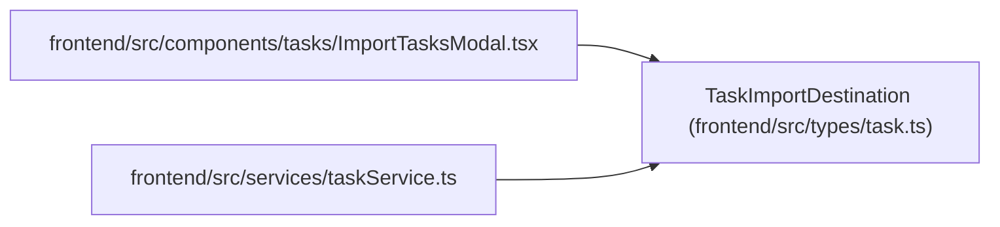

# TaskImportDestination

**Location:** `frontend/src/types/task.ts:254`
**Kind:** Type alias
**Bases:** —
**Module:** [types_task](../modules/types_task.md)

## Description

_Auto-generated from `TaskImportDestination` in `frontend/src/types/task.ts`._

## Attributes

*No annotated attributes found.*

## Methods

*No public methods. Inherits from base classes.*

## Relationships

<!-- Auto-generated relationship summary. Do not edit by hand. -->

### Summary

| Module | Methods | Attributes |
|---|---:|---|
| [types_task](../modules/types_task.md) | 0 | — |

### References

| Reference | Kind | Source | Call sites |
|---|---|---|---:|
| `ImportTasksModal` | import | [ImportTasksModal](../modules/ImportTasksModal.md) | — |
| `taskService` | import | [taskService](../modules/taskService.md) | — |
