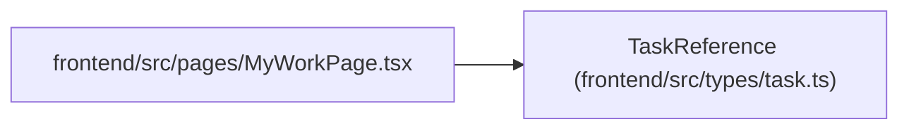

# TaskReference

**Location:** `frontend/src/types/task.ts:456`
**Kind:** Class
**Bases:** —
**Module:** [types_task](../modules/types_task.md)

## Description

_Auto-generated from `TaskReference` in `frontend/src/types/task.ts`._

## Attributes

| Name | Type | Required | Default | Description |
|------|------|----------|---------|-------------|
| `acceptance_current` | `boolean` | No | — | — |
| `project_name` | `string \| null` | No | — | — |
| `iteration_name` | `string \| null` | No | — | — |
| `blocked_reason` | `string \| null` | No | — | — |
| `canceled_at` | `string \| null` | No | — | — |
| `id` | `number` | Yes | — | — |
| `title` | `string` | Yes | — | — |
| `version` | `number` | Yes | — | — |
| `status` | `TaskStatus` | Yes | — | — |
| `project_id` | `number \| null` | Yes | — | — |
| `iteration_id` | `number \| null` | Yes | — | — |
| `parent_id` | `number \| null` | Yes | — | — |
| `owner_profile_id` | `number \| null` | Yes | — | — |

## Methods

*No public methods. Inherits from base classes.*

## Relationships

<!-- Auto-generated relationship summary. Do not edit by hand. -->

### Summary

| Module | Methods | Attributes |
|---|---:|---|
| [types_task](../modules/types_task.md) | 0 | `acceptance_current`, `blocked_reason`, `canceled_at`, `id`, `iteration_id`, `iteration_name`, `owner_profile_id`, `parent_id`, `project_id`, `project_name`, `status`, `title` |

### References

| Reference | Kind | Source | Call sites |
|---|---|---|---:|
| `MyWorkPage` | import | [MyWorkPage](../modules/MyWorkPage.md) | — |
