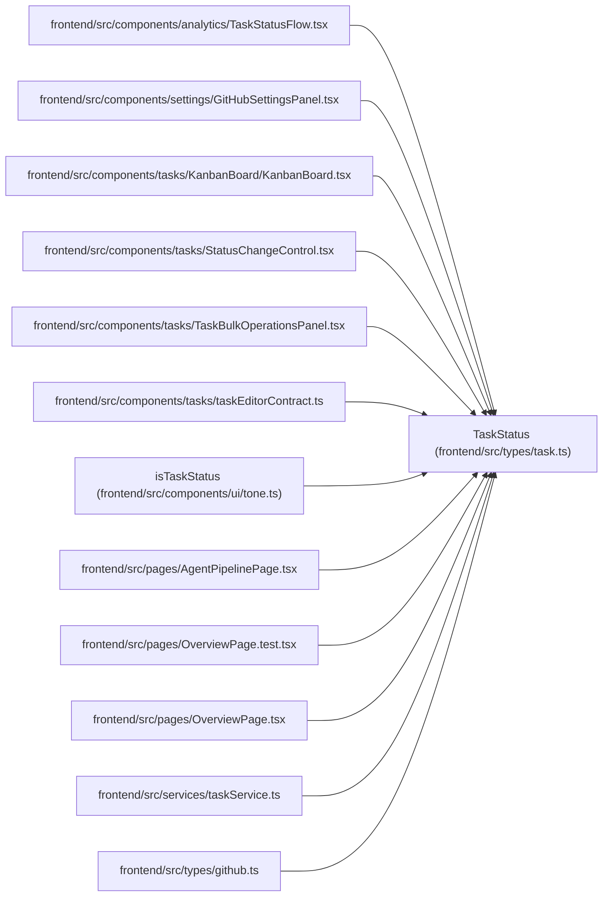

# TaskStatus

**Location:** `frontend/src/types/task.ts:44`
**Kind:** Type alias
**Bases:** —
**Module:** [types_task](../modules/types_task.md)

## Description

_Auto-generated from `TaskStatus` in `frontend/src/types/task.ts`._

## Attributes

*No annotated attributes found.*

## Methods

*No public methods. Inherits from base classes.*

## Relationships

<!-- Auto-generated relationship summary. Do not edit by hand. -->

### Summary

| Module | Methods | Attributes |
|---|---:|---|
| [types_task](../modules/types_task.md) | 0 | — |

### References

| Reference | Kind | Source | Call sites |
|---|---|---|---:|
| `TaskStatusFlow` | import | [TaskStatusFlow](../modules/TaskStatusFlow.md) | — |
| `GitHubSettingsPanel` | import | [GitHubSettingsPanel](../modules/GitHubSettingsPanel.md) | — |
| `KanbanBoard` | import | [KanbanBoard](../modules/KanbanBoard.md) | — |
| `StatusChangeControl` | import | [StatusChangeControl](../modules/StatusChangeControl.md) | — |
| `TaskBulkOperationsPanel` | import | [TaskBulkOperationsPanel](../modules/TaskBulkOperationsPanel.md) | — |
| `taskEditorContract` | import | [taskEditorContract](../modules/taskEditorContract.md) | — |
| `isTaskStatus` | type_reference | [tone](../modules/tone.md) | — |
| `AgentPipelinePage` | import | [AgentPipelinePage](../modules/AgentPipelinePage.md) | — |
| `OverviewPage.test` | import | [OverviewPage.test](../modules/OverviewPage.test.md) | — |
| `OverviewPage` | import | [OverviewPage](../modules/OverviewPage.md) | — |
| `taskService` | import | [taskService](../modules/taskService.md) | — |
| `github` | import | [types_github](../modules/types_github.md) | — |

> References: showing 12 of 14 logical references; 2 omitted by the 12-row generated summary limit.
