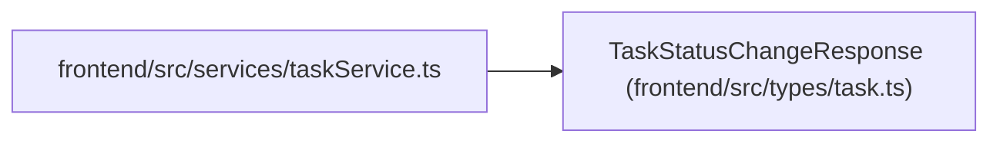

# TaskStatusChangeResponse

**Location:** `frontend/src/types/task.ts:331`
**Kind:** Class
**Bases:** —
**Module:** [types_task](../modules/types_task.md)

## Description

_Auto-generated from `TaskStatusChangeResponse` in `frontend/src/types/task.ts`._

## Attributes

| Name | Type | Default | Description |
|------|------|---------|-------------|
| `task` | `Task` | *required* | — |
| `cascade_updates` | `CascadeUpdateInfo[]` | *required* | — |
| `notifications_sent` | `boolean` | *required* | — |

## Methods

*No public methods. Inherits from base classes.*

## Relationships

<!-- Auto-generated relationship summary. Do not edit by hand. -->

### Summary

| Module | Methods | Attributes |
|---|---:|---|
| [types_task](../modules/types_task.md) | 0 | `cascade_updates`, `notifications_sent`, `task` |

### References

| Reference | Kind | Source | Call sites |
|---|---|---|---:|
| `taskService` | import | [taskService](../modules/taskService.md) | — |
