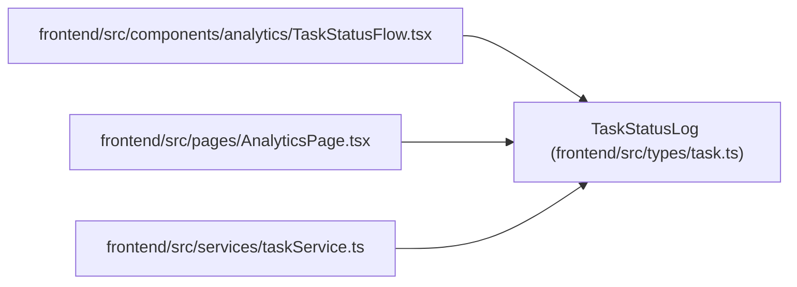

# TaskStatusLog

**Location:** `frontend/src/types/task.ts:312`
**Kind:** Class
**Bases:** —
**Module:** [types_task](../modules/types_task.md)

## Description

_Auto-generated from `TaskStatusLog` in `frontend/src/types/task.ts`._

## Attributes

| Name | Type | Default | Description |
|------|------|---------|-------------|
| `id` | `number` | *required* | — |
| `task_id` | `number` | *required* | — |
| `task_title` | `string` | *required* | — |
| `from_status` | `TaskStatus` | *required* | — |
| `to_status` | `TaskStatus` | *required* | — |
| `changed_at` | `string` | *required* | — |
| `reason` | `string` | *required* | — |
| `triggered_by` | `string` | *required* | — |
| `affected_task_ids` | `number[]` | *required* | — |

## Methods

*No public methods. Inherits from base classes.*

## Relationships

<!-- Auto-generated relationship summary. Do not edit by hand. -->

### Summary

| Module | Methods | Attributes |
|---|---:|---|
| [types_task](../modules/types_task.md) | 0 | `affected_task_ids`, `changed_at`, `from_status`, `id`, `reason`, `task_id`, `task_title`, `to_status`, `triggered_by` |

### References

| Reference | Kind | Source | Call sites |
|---|---|---|---:|
| `TaskStatusFlow` | import | [TaskStatusFlow](../modules/TaskStatusFlow.md) | — |
| `AnalyticsPage` | import | [AnalyticsPage](../modules/AnalyticsPage.md) | — |
| `taskService` | import | [taskService](../modules/taskService.md) | — |
