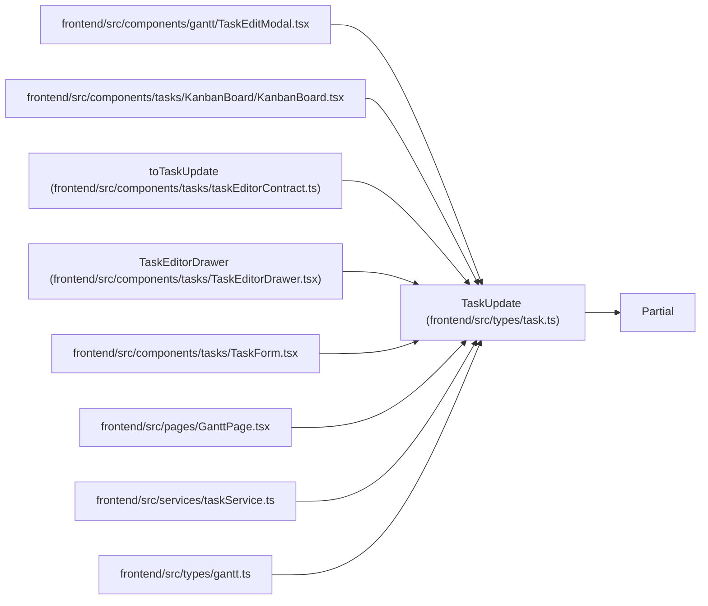

# TaskUpdate

**Location:** `frontend/src/types/task.ts:149`
**Kind:** Class
**Bases:** `Partial`
**Module:** [types_task](../modules/types_task.md)

## Description

_Auto-generated from `TaskUpdate` in `frontend/src/types/task.ts`._

## Attributes

| Name | Type | Default | Description |
|------|------|---------|-------------|
| `status` | `string` | *required* | — |
| `expected_version` | `number` | *required* | — |

## Methods

*No public methods. Inherits from base classes.*

## Relationships

<!-- Auto-generated relationship summary. Do not edit by hand. -->

### Summary

| Module | Methods | Attributes |
|---|---:|---|
| [types_task](../modules/types_task.md) | 0 | `expected_version`, `status` |

### Structure

| Kind | Entity | Module |
|---|---|---|
| Base | `Partial` | — |

### References

| Reference | Kind | Source | Call sites |
|---|---|---|---:|
| `TaskEditModal` | import | [TaskEditModal](../modules/TaskEditModal.md) | — |
| `KanbanBoard` | import | [KanbanBoard](../modules/KanbanBoard.md) | — |
| `toTaskUpdate` | type_reference | [taskEditorContract](../modules/taskEditorContract.md) | — |
| `TaskEditorDrawer` | type_reference | [TaskEditorDrawer](../modules/TaskEditorDrawer.md) | — |
| `TaskForm` | import | [TaskForm](../modules/TaskForm.md) | — |
| `GanttPage` | import | [GanttPage](../modules/GanttPage.md) | — |
| `taskService` | import | [taskService](../modules/taskService.md) | — |
| `gantt` | import | [types_gantt](../modules/types_gantt.md) | — |
