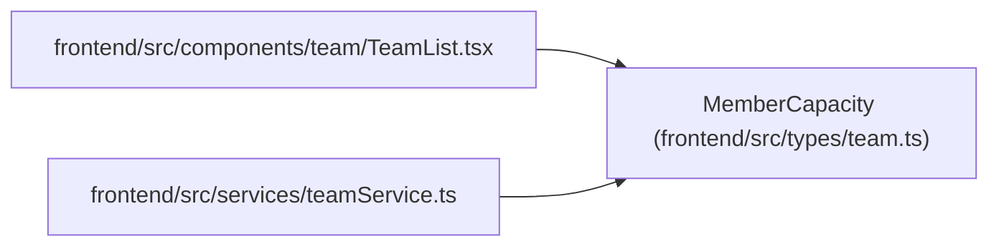

# MemberCapacity

**Location:** `frontend/src/types/team.ts:154`
**Kind:** Class
**Bases:** —
**Module:** [types_team](../modules/types_team.md)

## Description

Detailed capacity breakdown from GET /team-members/{id}/capacity.

## Attributes

| Name | Type | Required | Default | Description |
|------|------|----------|---------|-------------|
| `team_member_id` | `number` | Yes | — | — |
| `working_days` | `number` | Yes | — | — |
| `vacation_days` | `number` | Yes | — | — |
| `available_days` | `number` | Yes | — | — |
| `effective_days` | `number` | Yes | — | — |
| `adjusted_days` | `number` | Yes | — | — |
| `hours` | `number` | Yes | — | — |

## Methods

*No public methods. Inherits from base classes.*

## Relationships

<!-- Auto-generated relationship summary. Do not edit by hand. -->

### Summary

| Module | Methods | Attributes |
|---|---:|---|
| [types_team](../modules/types_team.md) | 0 | `adjusted_days`, `available_days`, `effective_days`, `hours`, `team_member_id`, `vacation_days`, `working_days` |

### References

| Reference | Kind | Source | Call sites |
|---|---|---|---:|
| `TeamList` | import | [TeamList](../modules/TeamList.md) | — |
| `teamService` | import | [teamService](../modules/teamService.md) | — |
