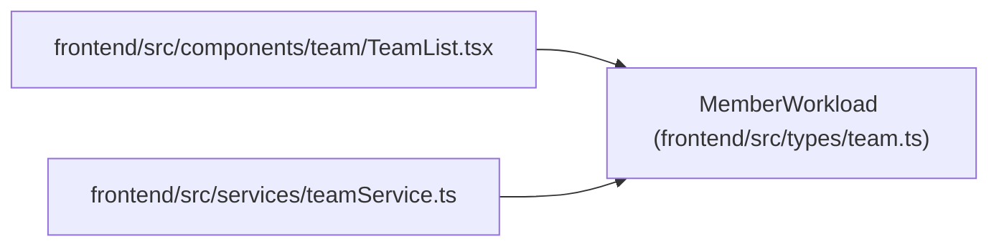

# MemberWorkload

**Location:** `frontend/src/types/team.ts:143`
**Kind:** Class
**Bases:** —
**Module:** [types_team](../modules/types_team.md)

## Description

_Auto-generated from `MemberWorkload` in `frontend/src/types/team.ts`._

## Attributes

| Name | Type | Default | Description |
|------|------|---------|-------------|
| `team_member_id` | `number` | *required* | — |
| `name` | `string` | *required* | — |
| `capacity_days` | `number` | *required* | — |
| `allocated_days` | `number` | *required* | — |
| `free_days` | `number` | *required* | — |
| `workload_status` | `'green' \| 'yellow' \| 'red'` | *required* | — |
| `workload_percent` | `number` | *required* | — |

## Methods

*No public methods. Inherits from base classes.*

## Relationships

<!-- Auto-generated relationship summary. Do not edit by hand. -->

### Summary

| Module | Methods | Attributes |
|---|---:|---|
| [types_team](../modules/types_team.md) | 0 | `allocated_days`, `capacity_days`, `free_days`, `name`, `team_member_id`, `workload_percent`, `workload_status` |

### References

| Reference | Kind | Source | Call sites |
|---|---|---|---:|
| `TeamList` | import | [TeamList](../modules/TeamList.md) | — |
| `teamService` | import | [teamService](../modules/teamService.md) | — |
