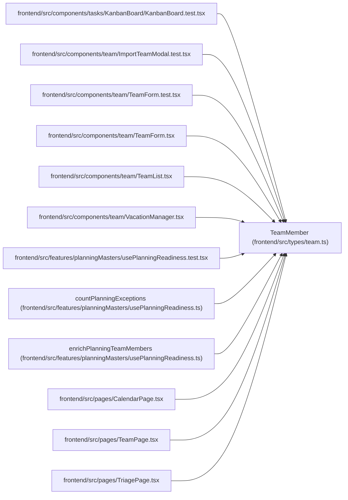

# TeamMember

**Location:** `frontend/src/types/team.ts:110`
**Kind:** Class
**Bases:** —
**Module:** [types_team](../modules/types_team.md)

## Description

_Auto-generated from `TeamMember` in `frontend/src/types/team.ts`._

## Attributes

| Name | Type | Default | Description |
|------|------|---------|-------------|
| `id` | `number` | *required* | — |
| `iteration_id` | `number` | *required* | — |
| `profile_id` | `number \| null` | *required* | — |
| `name` | `string` | *required* | — |
| `position` | `string` | *required* | — |
| `email` | `string` | *required* | — |
| `availability_percent` | `number` | *required* | — |
| `professionalism_coefficient` | `number` | *required* | — |
| `operational_utilization` | `number` | *required* | — |
| `profile` | `TeamMemberProfileCompact \| null` | *required* | — |
| `vacations` | `Vacation[]` | *required* | — |

## Methods

*No public methods. Inherits from base classes.*

## Relationships

<!-- Auto-generated relationship summary. Do not edit by hand. -->

### Summary

| Module | Methods | Attributes |
|---|---:|---|
| [types_team](../modules/types_team.md) | 0 | `availability_percent`, `email`, `id`, `iteration_id`, `name`, `operational_utilization`, `position`, `professionalism_coefficient`, `profile`, `profile_id`, `vacations` |

### References

| Reference | Kind | Source | Call sites |
|---|---|---|---:|
| `KanbanBoard.test` | import | [KanbanBoard.test](../modules/KanbanBoard.test.md) | — |
| `ImportTeamModal.test` | import | [ImportTeamModal.test](../modules/ImportTeamModal.test.md) | — |
| `TeamForm.test` | import | [TeamForm.test](../modules/TeamForm.test.md) | — |
| `TeamForm` | import | [TeamForm](../modules/TeamForm.md) | — |
| `TeamList` | import | [TeamList](../modules/TeamList.md) | — |
| `VacationManager` | import | [VacationManager](../modules/VacationManager.md) | — |
| `usePlanningReadiness.test` | import | [usePlanningReadiness.test](../modules/usePlanningReadiness.test.md) | — |
| `countPlanningExceptions` | type_reference | [usePlanningReadiness](../modules/usePlanningReadiness.md) | — |
| `enrichPlanningTeamMembers` | type_reference | [usePlanningReadiness](../modules/usePlanningReadiness.md) | — |
| `CalendarPage` | import | [CalendarPage](../modules/CalendarPage.md) | — |
| `TeamPage` | import | [TeamPage](../modules/TeamPage.md) | — |
| `TriagePage` | import | [TriagePage](../modules/TriagePage.md) | — |

> References: showing 12 of 13 logical references; 1 omitted by the 12-row generated summary limit.
