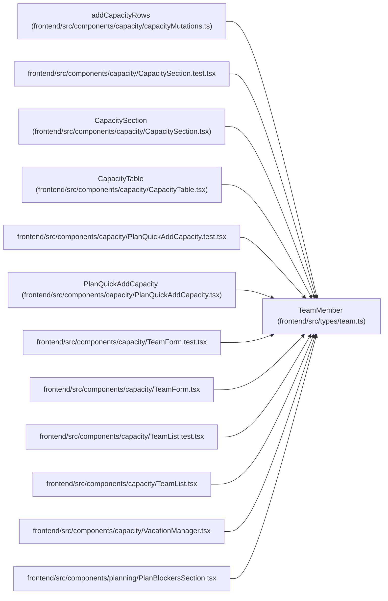

# TeamMember

**Location:** `frontend/src/types/team.ts:112`
**Kind:** Interface
**Bases:** —
**Module:** [types_team](../modules/types_team.md)

## Description

_Auto-generated from `TeamMember` in `frontend/src/types/team.ts`._

## Attributes

| Name | Type | Required | Default | Description |
|------|------|----------|---------|-------------|
| `id` | `number` | Yes | — | — |
| `iteration_id` | `number` | Yes | — | — |
| `profile_id` | `number \| null` | No | — | — |
| `name` | `string` | Yes | — | — |
| `position` | `string` | Yes | — | — |
| `email` | `string` | No | — | — |
| `availability_percent` | `number` | Yes | — | — |
| `professionalism_coefficient` | `number` | Yes | — | — |
| `operational_utilization` | `number` | Yes | — | — |
| `profile` | `TeamMemberProfileCompact \| null` | No | — | — |
| `vacations` | `Vacation[]` | Yes | — | — |

## Methods

*No declared methods.*

## Relationships

<!-- Auto-generated relationship summary. Do not edit by hand. -->

```mermaid
flowchart LR
    n0["TeamMember (frontend/src/types/team.ts)"]
    n1["addCapacityRows (frontend/src/components/capacity/capacityMutations.ts)"]
    n2["frontend/src/components/capacity/CapacitySection.test.tsx"]
    n3["CapacitySection (frontend/src/components/capacity/CapacitySection.tsx)"]
    n4["CapacityTable (frontend/src/components/capacity/CapacityTable.tsx)"]
    n5["frontend/src/components/capacity/PlanQuickAddCapacity.test.tsx"]
    n6["PlanQuickAddCapacity (frontend/src/components/capacity/PlanQuickAddCapacity.tsx)"]
    n7["frontend/src/components/capacity/TeamForm.test.tsx"]
    n8["frontend/src/components/capacity/TeamForm.tsx"]
    n9["frontend/src/components/capacity/TeamList.test.tsx"]
    n10["frontend/src/components/capacity/TeamList.tsx"]
    n11["frontend/src/components/capacity/VacationManager.tsx"]
    n12["frontend/src/components/planning/PlanBlockersSection.tsx"]
    n1 --> n0
    n2 --> n0
    n3 --> n0
    n4 --> n0
    n5 --> n0
    n6 --> n0
    n7 --> n0
    n8 --> n0
    n9 --> n0
    n10 --> n0
    n11 --> n0
    n12 --> n0
    click n0 "../modules/types_team.md"
    click n1 "../modules/capacityMutations.md"
    click n2 "../modules/CapacitySection.test.md"
    click n3 "../modules/CapacitySection.md"
    click n4 "../modules/CapacityTable.md"
    click n5 "../modules/PlanQuickAddCapacity.test.md"
    click n6 "../modules/PlanQuickAddCapacity.md"
    click n7 "../modules/TeamForm.test.md"
    click n8 "../modules/TeamForm.md"
    click n9 "../modules/TeamList.test.md"
    click n10 "../modules/TeamList.md"
    click n11 "../modules/VacationManager.md"
    click n12 "../modules/PlanBlockersSection.md"
```

### Summary

| Module | Methods | Attributes |
|---|---:|---|
| [types_team](../modules/types_team.md) | 0 | `availability_percent`, `email`, `id`, `iteration_id`, `name`, `operational_utilization`, `position`, `professionalism_coefficient`, `profile`, `profile_id`, `vacations` |

### References

| Reference | Kind | Source | Call sites |
|---|---|---|---:|
| `addCapacityRows` | type_reference | [capacityMutations](../modules/capacityMutations.md) | — |
| `CapacitySection.test` | import | [CapacitySection.test](../modules/CapacitySection.test.md) | — |
| `CapacitySection` | type_reference | [CapacitySection](../modules/CapacitySection.md) | — |
| `CapacityTable` | type_reference | [CapacityTable](../modules/CapacityTable.md) | — |
| `PlanQuickAddCapacity.test` | import | [PlanQuickAddCapacity.test](../modules/PlanQuickAddCapacity.test.md) | — |
| `PlanQuickAddCapacity` | type_reference | [PlanQuickAddCapacity](../modules/PlanQuickAddCapacity.md) | — |
| `TeamForm.test` | import | [TeamForm.test](../modules/TeamForm.test.md) | — |
| `TeamForm` | import | [TeamForm](../modules/TeamForm.md) | — |
| `TeamList.test` | import | [TeamList.test](../modules/TeamList.test.md) | — |
| `TeamList` | import | [TeamList](../modules/TeamList.md) | — |
| `VacationManager` | import | [VacationManager](../modules/VacationManager.md) | — |
| `PlanBlockersSection` | import | [PlanBlockersSection](../modules/PlanBlockersSection.md) | — |

> References: showing 12 of 25 logical references; 13 omitted by the 12-row generated summary limit.
