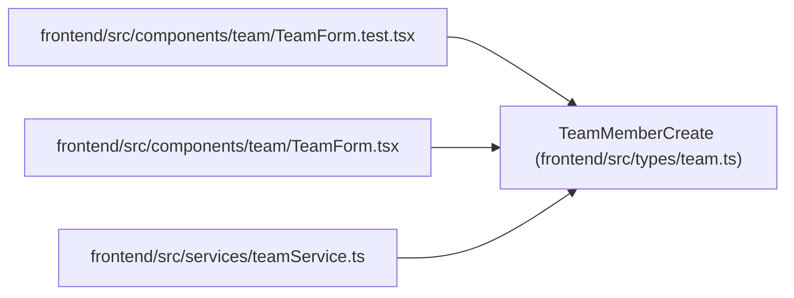

# TeamMemberCreate

**Location:** `frontend/src/types/team.ts:133`
**Kind:** Class
**Bases:** —
**Module:** [types_team](../modules/types_team.md)

## Description

_Auto-generated from `TeamMemberCreate` in `frontend/src/types/team.ts`._

## Attributes

| Name | Type | Default | Description |
|------|------|---------|-------------|
| `name` | `string` | *required* | — |
| `position` | `string` | *required* | — |
| `email` | `string` | *required* | — |
| `profile_id` | `number \| null` | *required* | — |
| `availability_percent` | `number` | *required* | — |
| `professionalism_coefficient` | `number` | *required* | — |
| `operational_utilization` | `number` | *required* | — |

## Methods

*No public methods. Inherits from base classes.*

## Relationships

<!-- Auto-generated relationship summary. Do not edit by hand. -->

### Summary

| Module | Methods | Attributes |
|---|---:|---|
| [types_team](../modules/types_team.md) | 0 | `availability_percent`, `email`, `name`, `operational_utilization`, `position`, `professionalism_coefficient`, `profile_id` |

### References

| Reference | Kind | Source | Call sites |
|---|---|---|---:|
| `TeamForm.test` | import | [TeamForm.test](../modules/TeamForm.test.md) | — |
| `TeamForm` | import | [TeamForm](../modules/TeamForm.md) | — |
| `teamService` | import | [teamService](../modules/teamService.md) | — |
