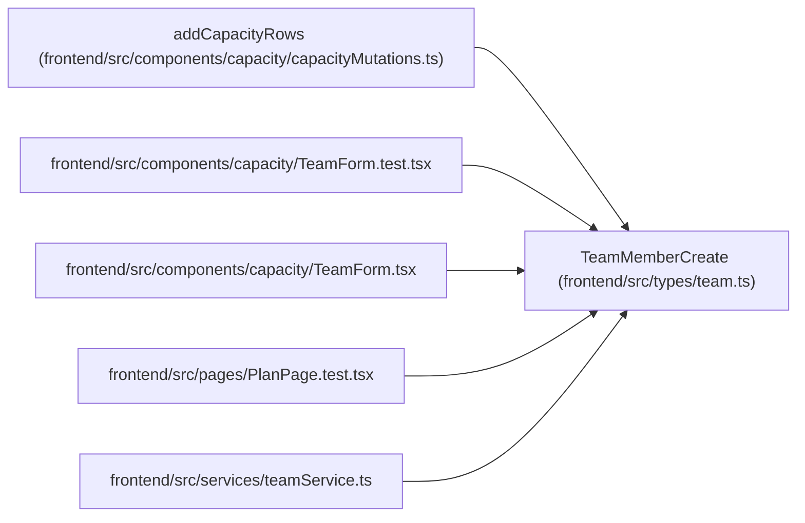

# TeamMemberCreate

**Location:** `frontend/src/types/team.ts:135`
**Kind:** Interface
**Bases:** —
**Module:** [types_team](../modules/types_team.md)

## Description

_Auto-generated from `TeamMemberCreate` in `frontend/src/types/team.ts`._

## Attributes

| Name | Type | Required | Default | Description |
|------|------|----------|---------|-------------|
| `name` | `string` | Yes | — | — |
| `position` | `string` | Yes | — | — |
| `email` | `string` | No | — | — |
| `profile_id` | `number \| null` | No | — | — |
| `availability_percent` | `number` | Yes | — | — |
| `professionalism_coefficient` | `number` | Yes | — | — |
| `operational_utilization` | `number` | Yes | — | — |

## Methods

*No declared methods.*

## Relationships

<!-- Auto-generated relationship summary. Do not edit by hand. -->

```mermaid
flowchart LR
    n0["TeamMemberCreate (frontend/src/types/team.ts)"]
    n1["addCapacityRows (frontend/src/components/capacity/capacityMutations.ts)"]
    n2["frontend/src/components/capacity/TeamForm.test.tsx"]
    n3["frontend/src/components/capacity/TeamForm.tsx"]
    n4["frontend/src/pages/PlanPage.test.tsx"]
    n5["frontend/src/services/teamService.ts"]
    n1 --> n0
    n2 --> n0
    n3 --> n0
    n4 --> n0
    n5 --> n0
    click n0 "../modules/types_team.md"
    click n1 "../modules/capacityMutations.md"
    click n2 "../modules/TeamForm.test.md"
    click n3 "../modules/TeamForm.md"
    click n4 "../modules/PlanPage.test.md"
    click n5 "../modules/teamService.md"
```

### Summary

| Module | Methods | Attributes |
|---|---:|---|
| [types_team](../modules/types_team.md) | 0 | `availability_percent`, `email`, `name`, `operational_utilization`, `position`, `professionalism_coefficient`, `profile_id` |

### References

| Reference | Kind | Source | Call sites |
|---|---|---|---:|
| `addCapacityRows` | type_reference | [capacityMutations](../modules/capacityMutations.md) | — |
| `TeamForm.test` | import | [TeamForm.test](../modules/TeamForm.test.md) | — |
| `TeamForm` | import | [TeamForm](../modules/TeamForm.md) | — |
| `PlanPage.test` | import | [PlanPage.test](../modules/PlanPage.test.md) | — |
| `teamService` | import | [teamService](../modules/teamService.md) | — |
