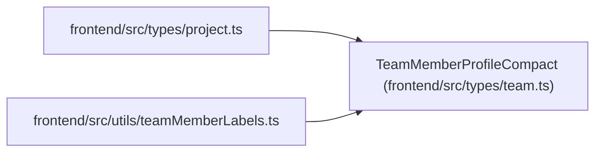

# TeamMemberProfileCompact

**Location:** `frontend/src/types/team.ts:76`
**Kind:** Class
**Bases:** —
**Module:** [types_team](../modules/types_team.md)

## Description

_Auto-generated from `TeamMemberProfileCompact` in `frontend/src/types/team.ts`._

## Attributes

| Name | Type | Required | Default | Description |
|------|------|----------|---------|-------------|
| `id` | `number` | Yes | — | — |
| `display_name` | `string` | Yes | — | — |
| `email` | `string \| null` | No | — | — |
| `headline` | `string \| null` | No | — | — |
| `automation_enabled` | `boolean` | Yes | — | — |
| `profile_kind` | `TeamMemberProfileKind` | Yes | — | — |
| `assignment_modes` | `TeamMemberAssignmentMode[]` | Yes | — | — |
| `skills` | `TeamMemberProfileSkill[]` | Yes | — | — |

## Methods

*No public methods. Inherits from base classes.*

## Relationships

<!-- Auto-generated relationship summary. Do not edit by hand. -->

### Summary

| Module | Methods | Attributes |
|---|---:|---|
| [types_team](../modules/types_team.md) | 0 | `assignment_modes`, `automation_enabled`, `display_name`, `email`, `headline`, `id`, `profile_kind`, `skills` |

### References

| Reference | Kind | Source | Call sites |
|---|---|---|---:|
| `project` | import | [types_project](../modules/types_project.md) | — |
| `teamMemberLabels` | import | [teamMemberLabels](../modules/teamMemberLabels.md) | — |
