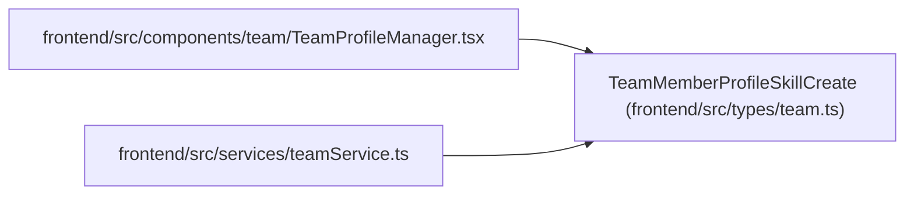

# TeamMemberProfileSkillCreate

**Location:** `frontend/src/types/team.ts:39`
**Kind:** Class
**Bases:** —
**Module:** [types_team](../modules/types_team.md)

## Description

_Auto-generated from `TeamMemberProfileSkillCreate` in `frontend/src/types/team.ts`._

## Attributes

| Name | Type | Required | Default | Description |
|------|------|----------|---------|-------------|
| `skill_key` | `string` | Yes | — | — |
| `skill_name` | `string` | Yes | — | — |
| `category` | `string \| null` | No | — | — |
| `level` | `number` | Yes | — | — |
| `interest` | `number` | Yes | — | — |
| `is_weakness` | `boolean` | Yes | — | — |
| `keywords_json` | `string[]` | No | — | — |
| `notes` | `string \| null` | No | — | — |

## Methods

*No public methods. Inherits from base classes.*

## Relationships

<!-- Auto-generated relationship summary. Do not edit by hand. -->

### Summary

| Module | Methods | Attributes |
|---|---:|---|
| [types_team](../modules/types_team.md) | 0 | `category`, `interest`, `is_weakness`, `keywords_json`, `level`, `notes`, `skill_key`, `skill_name` |

### References

| Reference | Kind | Source | Call sites |
|---|---|---|---:|
| `TeamProfileManager` | import | [TeamProfileManager](../modules/TeamProfileManager.md) | — |
| `teamService` | import | [teamService](../modules/teamService.md) | — |
