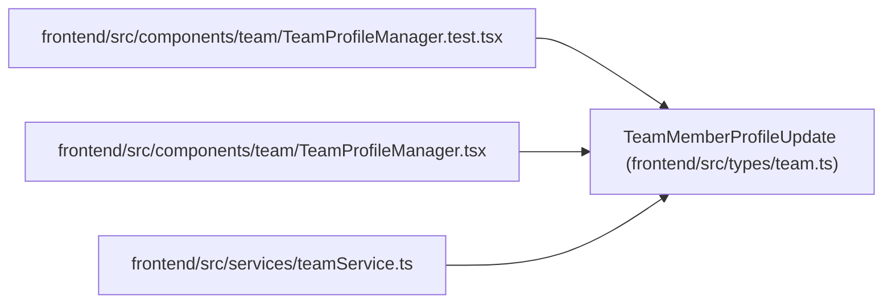

# TeamMemberProfileUpdate

**Location:** `frontend/src/types/team.ts:99`
**Kind:** Class
**Bases:** —
**Module:** [types_team](../modules/types_team.md)

## Description

_Auto-generated from `TeamMemberProfileUpdate` in `frontend/src/types/team.ts`._

## Attributes

| Name | Type | Default | Description |
|------|------|---------|-------------|
| `display_name` | `string` | *required* | — |
| `email` | `string \| null` | *required* | — |
| `headline` | `string \| null` | *required* | — |
| `summary` | `string \| null` | *required* | — |
| `notes` | `string \| null` | *required* | — |
| `automation_enabled` | `boolean` | *required* | — |
| `profile_kind` | `TeamMemberProfileKind` | *required* | — |
| `assignment_modes` | `TeamMemberAssignmentMode[]` | *required* | — |

## Methods

*No public methods. Inherits from base classes.*

## Relationships

<!-- Auto-generated relationship summary. Do not edit by hand. -->

### Summary

| Module | Methods | Attributes |
|---|---:|---|
| [types_team](../modules/types_team.md) | 0 | `assignment_modes`, `automation_enabled`, `display_name`, `email`, `headline`, `notes`, `profile_kind`, `summary` |

### References

| Reference | Kind | Source | Call sites |
|---|---|---|---:|
| `TeamProfileManager.test` | import | [TeamProfileManager.test](../modules/TeamProfileManager.test.md) | — |
| `TeamProfileManager` | import | [TeamProfileManager](../modules/TeamProfileManager.md) | — |
| `teamService` | import | [teamService](../modules/teamService.md) | — |
