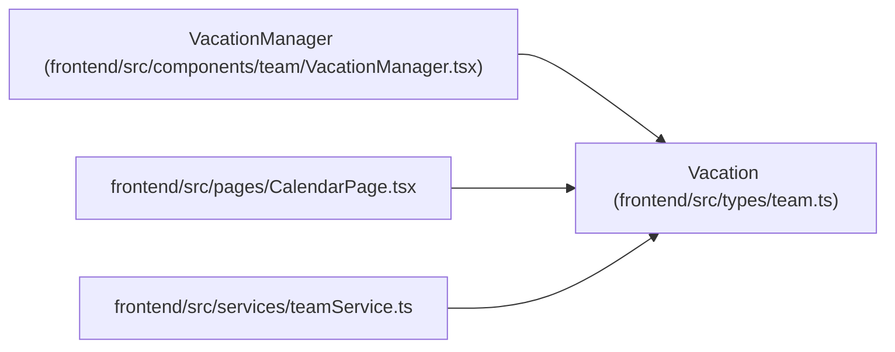

# Vacation

**Location:** `frontend/src/types/team.ts:1`
**Kind:** Class
**Bases:** —
**Module:** [types_team](../modules/types_team.md)

## Description

_Auto-generated from `Vacation` in `frontend/src/types/team.ts`._

## Attributes

| Name | Type | Required | Default | Description |
|------|------|----------|---------|-------------|
| `id` | `number` | Yes | — | — |
| `start_date` | `string` | Yes | — | — |
| `end_date` | `string` | Yes | — | — |

## Methods

*No public methods. Inherits from base classes.*

## Relationships

<!-- Auto-generated relationship summary. Do not edit by hand. -->

### Summary

| Module | Methods | Attributes |
|---|---:|---|
| [types_team](../modules/types_team.md) | 0 | `end_date`, `id`, `start_date` |

### References

| Reference | Kind | Source | Call sites |
|---|---|---|---:|
| `VacationManager` | type_reference | [VacationManager](../modules/VacationManager.md) | — |
| `CalendarPage` | import | [CalendarPage](../modules/CalendarPage.md) | — |
| `teamService` | import | [teamService](../modules/teamService.md) | — |
