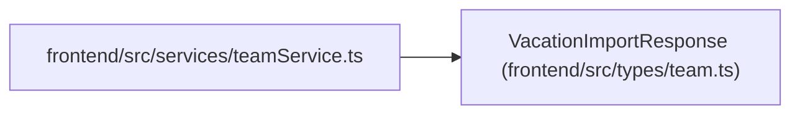

# VacationImportResponse

**Location:** `frontend/src/types/team.ts:17`
**Kind:** Class
**Bases:** —
**Module:** [types_team](../modules/types_team.md)

## Description

_Auto-generated from `VacationImportResponse` in `frontend/src/types/team.ts`._

## Attributes

| Name | Type | Default | Description |
|------|------|---------|-------------|
| `imported_count` | `number` | *required* | — |
| `skipped_count` | `number` | *required* | — |
| `errors` | `VacationImportError[]` | *required* | — |
| `vacations` | `Vacation[]` | *required* | — |

## Methods

*No public methods. Inherits from base classes.*

## Relationships

<!-- Auto-generated relationship summary. Do not edit by hand. -->

### Summary

| Module | Methods | Attributes |
|---|---:|---|
| [types_team](../modules/types_team.md) | 0 | `errors`, `imported_count`, `skipped_count`, `vacations` |

### References

| Reference | Kind | Source | Call sites |
|---|---|---|---:|
| `teamService` | import | [teamService](../modules/teamService.md) | — |
