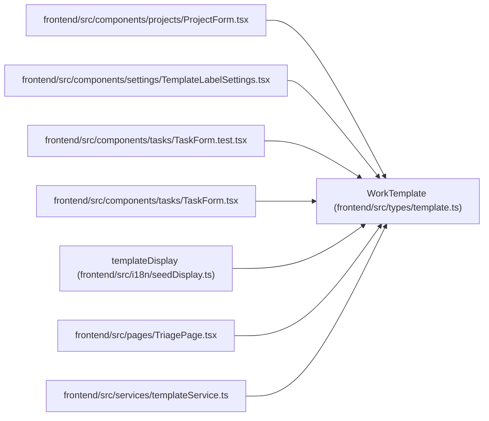

# WorkTemplate

**Location:** `frontend/src/types/template.ts:3`
**Kind:** Class
**Bases:** —
**Module:** [types_template](../modules/types_template.md)

## Description

_Auto-generated from `WorkTemplate` in `frontend/src/types/template.ts`._

## Attributes

| Name | Type | Required | Default | Description |
|------|------|----------|---------|-------------|
| `id` | `number` | Yes | — | — |
| `name` | `string` | Yes | — | — |
| `description` | `string \| null` | No | — | — |
| `seed_key` | `string \| null` | No | — | — |
| `template_type` | `TemplateType` | Yes | — | — |
| `default_title` | `string \| null` | No | — | — |
| `default_description` | `string \| null` | No | — | — |
| `default_priority` | `number \| null` | No | — | — |
| `default_effort_days` | `number \| null` | No | — | — |
| `default_labels` | `string[]` | Yes | — | — |
| `default_checklist` | `string[]` | Yes | — | — |
| `default_payload` | `Record<string, unknown>` | Yes | — | — |
| `is_active` | `boolean` | Yes | — | — |
| `sort_order` | `number` | Yes | — | — |
| `created_at` | `string` | Yes | — | — |
| `updated_at` | `string` | Yes | — | — |

## Methods

*No public methods. Inherits from base classes.*

## Relationships

<!-- Auto-generated relationship summary. Do not edit by hand. -->

### Summary

| Module | Methods | Attributes |
|---|---:|---|
| [types_template](../modules/types_template.md) | 0 | `created_at`, `default_checklist`, `default_description`, `default_effort_days`, `default_labels`, `default_payload`, `default_priority`, `default_title`, `description`, `id`, `is_active`, `name` |

### References

| Reference | Kind | Source | Call sites |
|---|---|---|---:|
| `ProjectForm` | import | [ProjectForm](../modules/ProjectForm.md) | — |
| `TemplateLabelSettings` | import | [TemplateLabelSettings](../modules/TemplateLabelSettings.md) | — |
| `TaskForm.test` | import | [TaskForm.test](../modules/TaskForm.test.md) | — |
| `TaskForm` | import | [TaskForm](../modules/TaskForm.md) | — |
| `templateDisplay` | type_reference | [seedDisplay](../modules/seedDisplay.md) | — |
| `TriagePage` | import | [TriagePage](../modules/TriagePage.md) | — |
| `templateService` | import | [templateService](../modules/templateService.md) | — |
