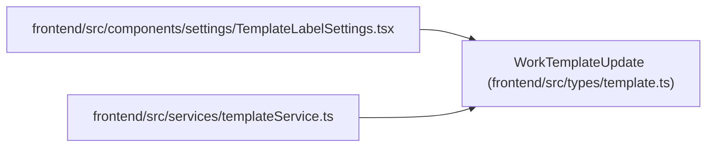

# WorkTemplateUpdate

**Location:** `frontend/src/types/template.ts:37`
**Kind:** Type alias
**Bases:** —
**Module:** [types_template](../modules/types_template.md)

## Description

_Auto-generated from `WorkTemplateUpdate` in `frontend/src/types/template.ts`._

## Attributes

*No annotated attributes found.*

## Methods

*No public methods. Inherits from base classes.*

## Relationships

<!-- Auto-generated relationship summary. Do not edit by hand. -->

### Summary

| Module | Methods | Attributes |
|---|---:|---|
| [types_template](../modules/types_template.md) | 0 | — |

### References

| Reference | Kind | Source | Call sites |
|---|---|---|---:|
| `TemplateLabelSettings` | import | [TemplateLabelSettings](../modules/TemplateLabelSettings.md) | — |
| `templateService` | import | [templateService](../modules/templateService.md) | — |
