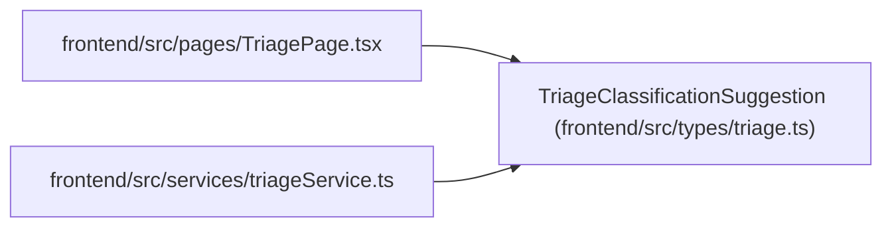

# TriageClassificationSuggestion

**Location:** `frontend/src/types/triage.ts:93`
**Kind:** Class
**Bases:** —
**Module:** [types_triage](../modules/types_triage.md)

## Description

_Auto-generated from `TriageClassificationSuggestion` in `frontend/src/types/triage.ts`._

## Attributes

| Name | Type | Required | Default | Description |
|------|------|----------|---------|-------------|
| `id` | `number` | Yes | — | — |
| `triage_item_id` | `number` | Yes | — | — |
| `suggested_type_label_slug` | `string \| null` | No | — | — |
| `suggested_area_label_slug` | `string \| null` | No | — | — |
| `suggested_priority` | `number \| null` | No | — | — |
| `suggested_label_slugs` | `string[]` | Yes | — | — |
| `unmatched_label_text` | `string[]` | Yes | — | — |
| `suggested_assignee_id` | `number \| null` | No | — | — |
| `suggested_assignee_hint` | `string \| null` | No | — | — |
| `suggested_project_id` | `number \| null` | No | — | — |
| `duplicate_candidates` | `Array<Record<string, unknown>>` | Yes | — | — |
| `confidence` | `number` | Yes | — | — |
| `rationale` | `string \| null` | No | — | — |
| `language` | `string \| null` | No | — | — |
| `provider` | `string \| null` | No | — | — |
| `model` | `string \| null` | No | — | — |
| `is_fallback` | `boolean` | Yes | — | — |
| `created_at` | `string` | Yes | — | — |

## Methods

*No public methods. Inherits from base classes.*

## Relationships

<!-- Auto-generated relationship summary. Do not edit by hand. -->

### Summary

| Module | Methods | Attributes |
|---|---:|---|
| [types_triage](../modules/types_triage.md) | 0 | `confidence`, `created_at`, `duplicate_candidates`, `id`, `is_fallback`, `language`, `model`, `provider`, `rationale`, `suggested_area_label_slug`, `suggested_assignee_hint`, `suggested_assignee_id` |

### References

| Reference | Kind | Source | Call sites |
|---|---|---|---:|
| `TriagePage` | import | [TriagePage](../modules/TriagePage.md) | — |
| `triageService` | import | [triageService](../modules/triageService.md) | — |
