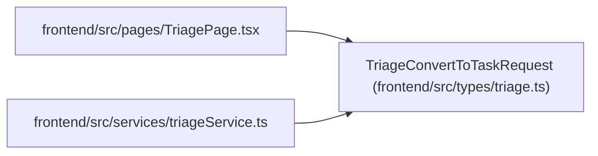

# TriageConvertToTaskRequest

**Location:** `frontend/src/types/triage.ts:145`
**Kind:** Class
**Bases:** —
**Module:** [types_triage](../modules/types_triage.md)

## Description

_Auto-generated from `TriageConvertToTaskRequest` in `frontend/src/types/triage.ts`._

## Attributes

| Name | Type | Required | Default | Description |
|------|------|----------|---------|-------------|
| `brief` | `TaskBrief` | No | — | — |
| `destination` | `"iteration" \| "project_backlog"` | No | — | — |
| `iteration_id` | `number \| null` | Yes | — | — |
| `title` | `string` | No | — | — |
| `description` | `string \| null` | No | — | — |
| `project_id` | `number \| null` | No | — | — |
| `assignee_id` | `number \| null` | No | — | — |
| `priority` | `number` | No | — | — |
| `tags` | `string[]` | No | — | — |
| `effort_days` | `number \| null` | Yes | — | — |
| `effort_hours` | `number \| null` | No | — | — |
| `depends_on` | `number[]` | Yes | — | — |

## Methods

*No public methods. Inherits from base classes.*

## Relationships

<!-- Auto-generated relationship summary. Do not edit by hand. -->

### Summary

| Module | Methods | Attributes |
|---|---:|---|
| [types_triage](../modules/types_triage.md) | 0 | `assignee_id`, `brief`, `depends_on`, `description`, `destination`, `effort_days`, `effort_hours`, `iteration_id`, `priority`, `project_id`, `tags`, `title` |

### References

| Reference | Kind | Source | Call sites |
|---|---|---|---:|
| `TriagePage` | import | [TriagePage](../modules/TriagePage.md) | — |
| `triageService` | import | [triageService](../modules/triageService.md) | — |
